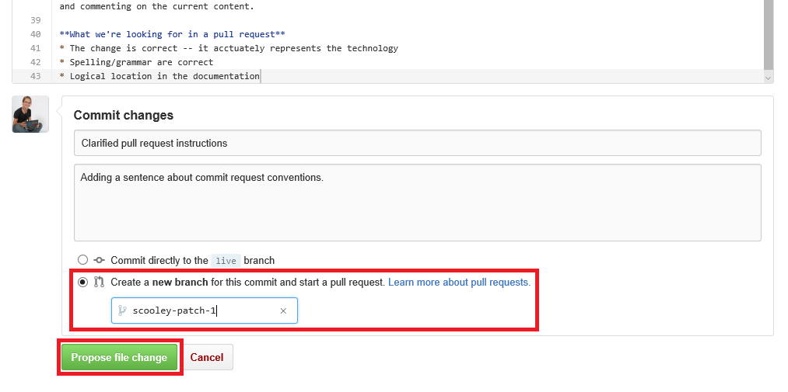

# <a name="contribute-to-the-docs"></a>Участие в разработке документации

> **Примечание.** Для участия в составлении документации необходимо иметь учетную запись [GitHub](https://www.github.com).

## <a name="edit-an-existing-doc"></a>Редактирование существующего документа

1. Найдите документ, который следует отредактировать.  

2. Выберите **Contribute to this topic** (Изменить этот раздел).  
  
  
  Вы будете автоматически перенаправлены в GitHub в файл разметки, связанный с этим файлом.
  
  Убедитесь, что вы вошли в GitHub.  В противном случае выполните вход или создайте учетную запись GitHub.
  
  
  
3. Выберите значок правки для редактирования в редакторе браузера.
  
  

4. Внесите соответствующие изменения.
  
  Возможные действия:
  1. Изменение файла
  2. Просмотр изменений
  3. Переименование файла (крайне маловероятно, что это потребуется)
  
  
  
5. Предложить изменения в виде запроса на включение
  
  

6. Проверить изменения
  
  **Что проверяется в запросе на включение**  
  * Изменение верно— достоверно представляет технологию
  * Правильная орфография и грамматика
  * Логическое расположение в документации
    
  

7. Создание [запроса на включение внесенных изменений](contribute-to-docs.md#pull-requests)  

## <a name="pull-requests"></a>Запрос на включение

Большинство изменений будут внесены по запросу на включение.  Запрос на включение— способ проверки набора изменений несколькими рецензентами, а также изменения и комментирования текущего содержимого.


## <a name="fork-the-repo-and-edit-locally"></a>Разветвление репозитория и локальное редактирование

Для длительной работы с документами клонируйте репозиторий в локальную среду и пользуйтесь им на своем компьютере.

Следующее руководство описывает, как эмулировать мою настройку (автор— Сара Кули (Sarah Cooley)).  Существует множество альтернативных настроек, которые работают одинаково хорошо.

> **Примечание.** Все эти средства для работы с документами функционируют одинаково хорошо на Linux или OSX.  Если вам нужны другие руководства, запросите их.

Процедура делится на три этапа:
* [Настройка Git](contribute-to-docs.md#set-up-git)
  * Установка Git
  * Начальная настройка
  * Разветвление репозитория документации
  * Клонирование копии на локальный компьютер
* [Первоначальное управление учетными данными](contribute-to-docs.md#validate-and-stash-credentials)
  * Сведения о задании учетных данных и вспомогательном средстве для них
* [Настройка среды документов](contribute-to-docs.md#set-up-markdown-editing-environment)
  * Установка VSCode
  * Пошаговое рассмотрение некоторых удобных функций VSCode для Git
  * Первая фиксация

### <a name="set-up-git"></a>Настройка Git

1. Установите Git (в Windows) [отсюда](https://git-for-windows.github.io/)

  В установке нужно изменить всего одно значение:

  **Настройка среды PATH**. Используйте Git из командной строки Windows.

  

  Это позволяет использовать команды Git в консоли PowerShell или в любой консоли Windows.

2. Настройте свое удостоверение Git.

  Откройте окно PowerShell и выполните следующую команду:

  ``` PowerShell
  git config --global user.name "User Name"
  git config --global user.email username@microsoft.com
  ```

  Git использует эти значения для обозначения фиксаций.

  > Если возникает приведенная ниже ошибка, возможно, Git установлен неправильно или необходимо перезапустить PowerShell.
    ``` PowerShell
    git : The term 'git' is not recognized as the name of a cmdlet, function, script file, or operable program. Check the spelling of the name, or if a path was included, verify that the path is correct and try again.
    ```

3. Настройте свою среду Git.

   Настройте вспомогательное средство для учетных данных, чтобы ввести имя пользователя и пароль только один раз (по крайней мере на этом компьютере).
   Я использую это простое [вспомогательное средство для учетных данных Windows](https://github.com/Microsoft/Git-Credential-Manager-for-Windows#download-and-install)

   После установки выполните следующую команду, чтобы включить вспомогательное средство для учетных данных и задать поведение принудительной отправки:
   ```
   git config --global credential.helper manager
   git config --global push.default simple
   ```

   При первом запуске необходимо выполнить проверку подлинности для GitHub— вам будет предложено ввести свое имя пользователя и код двухфакторной проверки подлинности, если он используется.
   Пример.
   ```
   C:\Users\plang\Source\Repos\Virtualization-Documentation [master]> git pull
   Please enter your GitHub credentials for https://github.com/
   username: plang@microsoft.com
   password:
   authcode (app): 562689
   ```
   При этом автоматически создается [личный маркер доступа](https://github.com/settings/tokens) с соответствующими разрешениями на GitHub; сохраните его в защищенном расположении на локальном компьютере. Больше этот запрос выводиться не должен.

4. Выполните разветвление репозитория.

5. Клонируйте репозиторий.

  Клон Git создает локальную копию репозитория с подходящими обработчиками для синхронизации с другими клонами того же репозитория.

  По умолчанию клон создает в текущем каталоге папку, имя которой совпадает с именем репозитория.  Я храню все репозитории Git в своем каталоге пользователя.  Дополнительные сведения о клонировании в Git см. [здесь](http://git-scm.com/docs/git-clone).

  ``` PowerShell
  cd ~
  git clone https://github.com/Microsoft/Virtualization-Documentation.git
  ```

  Если процедура будет успешно выполнена, появится папка `Virtualization-Documentation`.

  ``` PowerShell
  cd Virtualization-Documentation
  ```

5. [Необязательно] Настройте Posh-Git.

  Posh-Git— это модуль PowerShell, который создан членами сообщества и делает работу с Git в PowerShell немного удобнее.  Он добавляет заполнение нажатием клавиши в Git для PowerShell, а также отображение сведений о ветвлении и состоянии файла в командной строке.  Дополнительные сведения о нем см. [здесь](https://github.com/dahlbyk/posh-git).  Posh-Git можно установить, выполнив приведенную ниже команду в консоли администратора PowerShell.

  ``` PowerShell
  Install-Module -Name posh-git
  ```

  Чтобы автоматически запускать Posh-Git при каждом открытии PowerShell, добавьте следующий код в свой профиль PowerShell (например, `%UserProfile%\My Documents\WindowsPowerShell\profile.ps1 `).

  ``` PowerShell
  Import-Module posh-git

  function global:prompt {
    $realLASTEXITCODE = $LASTEXITCODE

    Write-Host($pwd.ProviderPath) -nonewline

    Write-VcsStatus

    $global:LASTEXITCODE = $realLASTEXITCODE
    return "> "
  }
  ```

### <a name="validate-and-stash-credentials"></a>Проверка и задание учетных данных

  Чтобы проверить, правильно ли настроен репозиторий, попробуйте извлечь новое содержимое.

  ``` PowerShell
  git pull
  ```


### <a name="set-up-markdown-editing-environment"></a>Настройка среды редактирования разметки

1. Скачайте VSCode.

6. Выполните тестовую фиксацию.  Если учетные данные заданы правильно, все должно работать как нужно.


