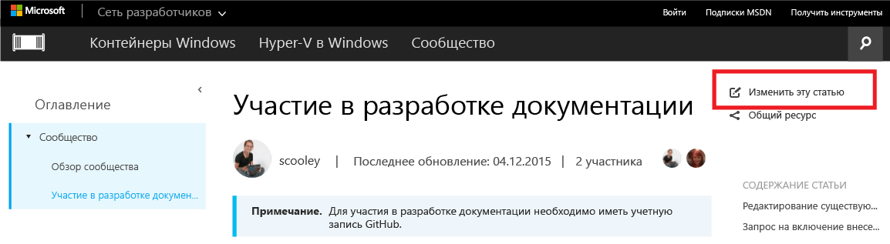

# Участие в разработке документации

> **Примечание.** Для участия в разработке документов необходимо иметь учетную запись [GitHub](https://www.github.com).

## Редактирование существующего документа

1. Найдите документ, который следует отредактировать.

2. Выберите **Contribute to this topic (Изменить этот раздел)**  
    

    Вы будете автоматически перенаправлены в GitHub в файл разметки, связанный с этим файлом.

    Убедитесь, что вы вошли в GitHub. В противном случае выполните вход или создайте учетную запись GitHub.

    

3. Выберите значок правки для редактирования в редакторе браузера.

    

4. Внесите соответствующие изменения.

    Возможные действия:
    1. Изменение файла
    2. Просмотр изменений
    3. Переименование файла (крайне маловероятно, что это потребуется)

    

5. Предложить изменения в виде запроса на включение

    

6. Проверить изменения

    **Что проверяется в запросе на включение**
    * Изменение верно — достоверно представляет технологию
    * Правильная орфография и грамматика
    * Логическое расположение в документации

    

7. Создание [запроса на включение](contribute_to_docs.md#pull-requests)

## Запрос на включение

Большинство изменений будут внесены по запросу на включение. Запрос на включение — способ проверки набора изменений несколькими рецензентами, а также изменения и комментирования текущего содержимого.

