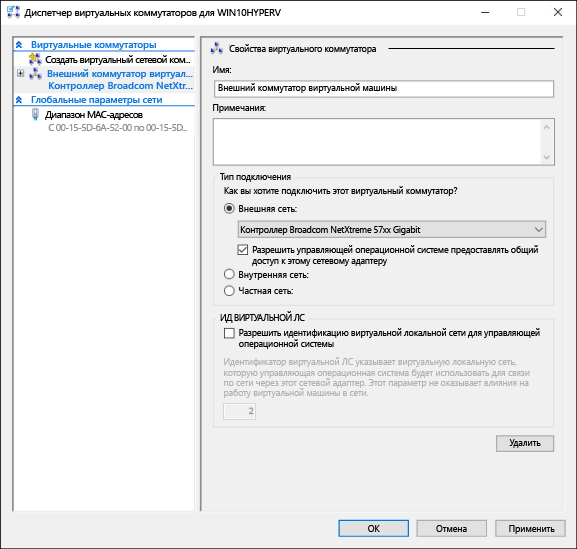
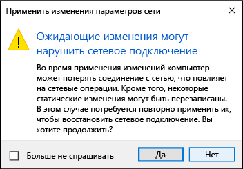

# <a name="create-a-virtual-network"></a>Создание виртуальной сети

Вашей виртуальной машине потребуется виртуальная сеть, чтобы предоставить вашему компьютеру доступ к сети.  Создание виртуальной сети— необязательный шаг. Если виртуальную машину не требуется подключать к Интернету или сети, перейдите к шагу [создания виртуальной машины Windows](create-virtual-machine.md).


## <a name="connect-virtual-machines-to-the-internet"></a>Подключение виртуальных машин к Интернету

Hyper-V поддерживает три типа виртуальных коммутаторов: внешние, внутренние и частные. Создайте внешний коммутатор, чтобы предоставить доступ к сети вашего компьютера виртуальным машинам, работающим на нем.

В этом упражнении выполняется создание внешнего виртуального коммутатора. После завершения этого шага на узле Hyper-V будет виртуальный коммутатор, который сможет подключать виртуальные машины к Интернету через сетевое подключение вашего компьютера. 

### <a name="create-a-virtual-switch-with-hyper-v-manager"></a>Создание виртуального коммутатора с помощью диспетчера Hyper-V

1. Откройте диспетчер Hyper-V.  Чтобы сделать это быстро, нажмите кнопку или клавишу Windows и введите "Hyper-V Manager".  
Если диспетчер Hyper-V найти не удается, это значит, что Hyper-V или средства управления Hyper-V отключены.  Инструкции по включению см. в разделе [Включение Hyper-V](enable-hyper-v.md).

2. Выберите сервер в левой области или нажмите кнопку «Подключиться к серверу...» в правой области.

3. В диспетчере Hyper-V выберите пункт **Диспетчер виртуальных коммутаторов...** в меню "Действия" справа. 

4. В разделе "Виртуальные коммутаторы" выберите пункт **Создать виртуальный сетевой коммутатор**.

5. В окне "Виртуальный коммутатор какого типа вы хотите создать?" выберите **Внешний**.

6. Нажмите кнопку **Создать виртуальный коммутатор**.

7. В разделе "Свойства виртуального коммутатора" назначьте ему имя, например **Внешний коммутатор виртуальных машин**.

8. В разделе "Тип подключения" убедитесь, что выбрана **Внешняя сеть**.

9. Выберите физический сетевой адаптер для связывания с новым виртуальным коммутатором. Этот сетевой адаптер физически подключен к сети.  

    

10. Нажмите кнопку **Применить**, чтобы создать виртуальный коммутатор. На этом этапе, скорее всего, появится приведенное ниже сообщение. Щелкните **Да**, чтобы продолжить.

      

11. Нажмите кнопку **ОК**, чтобы закрыть окно диспетчера виртуальных коммутаторов.


### <a name="create-a-virtual-switch-with-powershell"></a>Создание виртуального коммутатора с помощью PowerShell

Чтобы создать виртуальный коммутатор с внешним подключением с помощью PowerShell: 

1. Используйте команду **Get-NetAdapter**, чтобы вернуть список сетевых адаптеров, подключенных к системе Windows10.

    ```powershell
    PS C:\> Get-NetAdapter

    Name                      InterfaceDescription                    ifIndex Status       MacAddress             LinkSpeed
    ----                      --------------------                    ------- ------       ----------             ---------
    Ethernet 2                Broadcom NetXtreme 57xx Gigabit Cont...       5 Up           BC-30-5B-A8-C1-7F         1 Gbps
    Ethernet                  Intel(R) PRO/100 M Desktop Adapter            3 Up           00-0E-0C-A8-DC-31        10 Mbps  
    ```

2. Выберите сетевой адаптер для использования с коммутатором Hyper-V и разместите экземпляр в переменной **$net**.

    ```
    $net = Get-NetAdapter -Name 'Ethernet'
    ```

3. Выполните следующую команду, чтобы создать новый виртуальный коммутатор Hyper-V.

    ```
    New-VMSwitch -Name "External VM Switch" -AllowManagementOS $True -NetAdapterName $net.Name
    ```

## <a name="virtual-networking-on-a-laptop"></a>Виртуальная сеть на ноутбуке

### <a name="nat-networking"></a>Сеть NAT
Механизм преобразования сетевых адресов (NAT) предоставляет виртуальной машине доступ к сети вашего компьютера путем объединения IP-адреса главного компьютера с портом через внутренний виртуальный коммутатор Hyper-V.

У этого механизма есть ряд полезных возможностей.
1. NAT экономит IP-адреса за счет сопоставления внешнего IP-адреса и порта с гораздо большим набором внутренних IP-адресов. 
2. NAT позволяет нескольким виртуальным машинам размещать приложения, которым требуются одинаковые (внутренние) порты связи, сопоставляя их с уникальными внешними портами.
3. NAT использует внутренний коммутатор. После создания внутреннего коммутатора вы можете не использовать сетевое подключение. Кроме того, за счет этого снижается нагрузка на сет компьютера.

Чтобы настроить сеть NAT и подключить ее к виртуальной машине, см. [Руководство пользователя по созданию сети NAT](../user-guide/setup-nat-network.md).

### <a name="the-two-switch-approach"></a>Подход с использованием двух коммутаторов
Если вы используете Hyper-V в Windows 10 на ноутбуке и часто переключаетесь между беспроводной и проводной сетями, вы можете создать виртуальный коммутатор как для сетевой карты Ethernet, так и для карты беспроводной сети. В такой конфигурации можно переключать виртуальные машины между этими коммутаторами в зависимости от типа сетевого подключения ноутбука. Виртуальные машины не будут автоматически переключаться между проводными и беспроводными сетями.
>Примечание. Настройка внешнего виртуального коммутатора на адаптере беспроводной сети не поддерживается и должна использоваться только для тестирования.  


## <a name="next-step---create-a-virtual-machine"></a>Следующий шаг— создание виртуальной машины
[Создание виртуальной машины Windows](create-virtual-machine.md)
