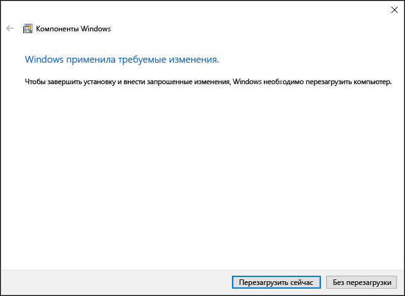

# Установка Hyper-V в Windows 10

Включение Hyper-V для создания виртуальных машин в Windows 10.  
Hyper-V можно включить разными способами, в том числе используя панель управления Windows 10, PowerShell или с помощью средства обслуживания образов развертывания и управления ими (DISM). В этом документе последовательно описан каждый из указанных способов.

> **Примечание.**  Механизм Hyper-V встроен в Windows в качестве дополнительной функции. Скачать или установить Hyper-V нельзя. 

## Проверьте следующие требования

* Windows 10 Корпоративная, Профессиональная или для образовательных учреждений
* 64-разрядный процессор с поддержкой преобразования адресов второго уровня (SLAT).
* Поддержка расширения режима мониторинга виртуальной машины (технология VT-c на компьютерах с процессорами Intel).
* Не менее 4 ГБ оперативной памяти.

Роль Hyper-V **невозможно** установить в Windows 10 Домашняя.  
Выполните обновление с выпуска Windows 10 Домашняя до выпуска Windows 10 Профессиональная, открыв раздел **Параметры** > **Обновление и безопасность** > **Активация**.

Дополнительные сведения и советы по устранению неполадок см. в статье [Требования к системе для Hyper-V в Windows 10](../reference/hyper-v-requirements.md).


## Установка Hyper-V 
Механизм Hyper-V встроен в Windows в качестве дополнительной функции. Скачать или установить Hyper-V нельзя.  Существует несколько способов включения встроенной роли Hyper-V.

### Включение Hyper-V с помощью PowerShell

1. Откройте консоль PowerShell от имени администратора.

2. Выполните следующую команду.
  ```powershell
  Enable-WindowsOptionalFeature -Online -FeatureName Microsoft-Hyper-V -All
  ```  

  Если не удается найти команду, убедитесь, что вы используете PowerShell от имени администратора.  

После завершения установки необходимо перезагрузить компьютер.  

### Включение Hyper-V с помощью CMD и DISM

Система обслуживания образов развертывания и управления ими (DISM) позволяет настраивать ОС Windows и образы Windows.  Помимо всего прочего? средство DISM может включать функции Windows во время выполнения операционной системы.  

Чтобы включить роль Hyper-V с помощью DISM, выполните указанные ниже действия.
1. Запустите PowerShell или сеанс CMD от имени администратора.

2. Введите следующую команду:  
  ```powershell
  DISM /Online /Enable-Feature /All /FeatureName:Microsoft-Hyper-V
  ```  
  

Дополнительные сведения о DISM см. в разделе [Техническое руководство по DISM](https://technet.microsoft.com/en-us/library/hh824821.aspx).

### Включение роли Hyper-V вручную

1. Щелкните правой кнопкой мыши кнопку Windows и выберите пункт "Программы и компоненты".

2. Выберите пункт **Включение или отключение компонентов Windows**.

3. Выберите **Hyper-V** и нажмите кнопку **ОК**.  


После завершения установки вам будет предложено перезапустить компьютер.




## Следующий шаг — настройка сети
[Подключение к Интернету](connect-to-network.md)

