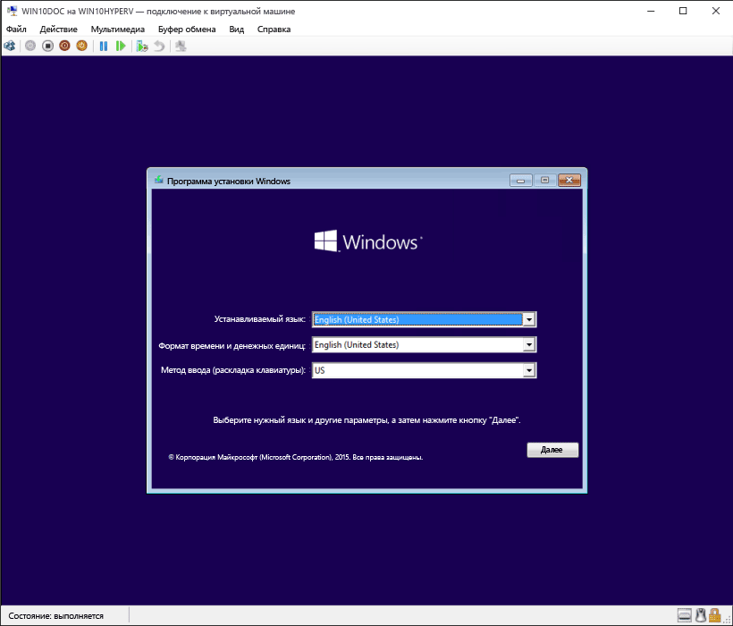

# Создание виртуальной машины с помощью Hyper-V

Создайте виртуальную машину и установите ее операционную систему.

Мы создали новые средства для создания виртуальных машин, чтобы они были значительно изменены в течение прошлых трех выпусков.

Выберите вашу операционную систему для получения соответствующего набора инструкций:

* [Обновление Windows 10 для дизайнеров (v1709) и более поздних версий](quick-create-virtual-machine.md#windows-10-fall-creators-update-windows-10-version-1709)
* [Windows 10 для дизайнеров Update (v1703)](quick-create-virtual-machine.md#windows-10-creators-update-windows-10-version-1703)
* [Юбилейное обновление Windows 10 (v1607) и более ранние версии](quick-create-virtual-machine.md#before-windows-10-creators-update-windows-10-version-1607-and-earlier)

Начнем.

## Обновление Windows 10 для дизайнеров Creator (Windows 10 версии 1709)

В выпуске Fall Creators Update функция "Быстрое создание" была расширена и теперь включает коллекцию виртуальных машин, которую можно запустить независимо от диспетчера Hyper-V.

Для создания новой виртуальной машины в выпуске Fall Creators Update сделайте следующее:

1. Откройте средство быстрого создания Hyper-V через меню "Пуск".

    

1. Выберите операционную систему или собственный образ с помощью локального источника установки.

    

    1. Если вы хотите использовать собственный образ для создания виртуальной машины, выберите **Локальный источник установки**.
    1. Выберите **Изменить источник установки**.
      Кнопка 
    1. Выберите образ .iso или .vhdx, который требуется преобразовать в новую виртуальную машину.
    1. Если используется образ Linux, отключите параметр "Безопасная загрузка".
      Кнопка 

1. Выберите "Создать виртуальную машину"

Вот и все!  Средство быстрого создания сделает все остальное.

## Обновление Windows 10 для дизайнеров (Windows 10 версии 1703)

1. Откройте диспетчер Hyper-V через меню "Пуск".

1. В диспетчере Hyper-V найдите пункт **Быстрое создание** в правой части меню **Действия**.

1. Настройте виртуальную машину.

    * Присвойте имя виртуальной машине (необязательно).
    * Выберите установочный носитель для виртуальной машины. Установку можно выполнить из файла ISO или VHDX.
    Если вы устанавливаете Windows на виртуальной машине, можно включить безопасную загрузку Windows. В противном случае не устанавливайте этот флажок.
    * Настройка сети.
    Если у вас есть виртуальный коммутатор, его можно выбрать в раскрывающемся списке сетей. Если у вас нет коммутатора, отобразится кнопка для автоматической настройки виртуальной сети.

1. Нажмите кнопку **Подключить** для запуска виртуальной машины. Не стоит беспокоиться о настройке параметров. Это можно сделать в любое время.

    Нажмите любую клавишу для загрузки с компакт- или DVD-диска при появлении соответствующего запроса.  Система распознала, что установка выполняется с компакт-диска.

Поздравляем! Вы создали новую виртуальную машину.  Теперь все готово к установке операционной системы.

Виртуальная машина должна иметь следующий вид.

> **Примечание.** Если вы не используете корпоративную лицензию на Windows, требуется отдельная лицензия для Windows, установленная в виртуальной машине. Операционная система виртуальной машины не зависит от операционной системы узла.

## Перед обновлением Windows 10 Creators (Windows 10 версии 1607 и более ранних версий)

Если вы используете не Windows 10 Creators Update или более позднюю версию ОС, выполните следующие инструкции с помощью мастера создания виртуальной машины.

1. [Создание виртуальной сети](connect-to-network.md)
1. [Создание новой виртуальной машины](create-virtual-machine.md)
