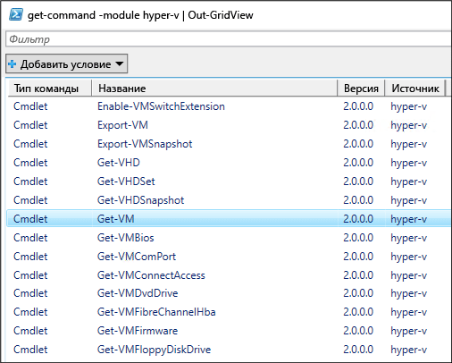
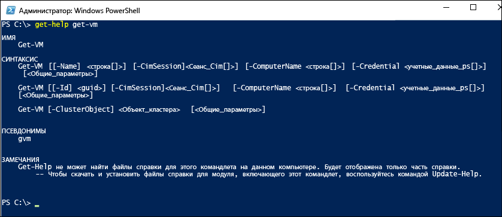
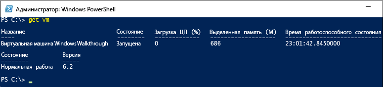

# <a name="working-with-hyper-v-and-windows-powershell"></a>Работа с Hyper-V и Windows PowerShell

Изучив основы развертывания Hyper-V, создания виртуальных машин и управления ими, давайте теперь узнаем, как можно автоматизировать многие из связанных с этим действий с помощью PowerShell.

### <a name="return-a-list-of-hyper-v-commands"></a>Получение списка команд Hyper-V

1. Нажмите кнопку "Пуск" в Windows и введите **PowerShell**.
2. Запустите указанную ниже команду, чтобы отобразить список команд PowerShell, доступных в модуле PowerShell Hyper-V.

 ```powershell
Get-Command -Module hyper-v | Out-GridView
```
  Отобразится примерно следующее:

  

3. Чтобы получить дополнительные сведения о конкретной команде PowerShell, введите команду `Get-Help`. Например, запустив указанную ниже команду, вы получите информацию о команде `Get-VM` Hyper-V.

  ```powershell
  Get-Help Get-VM
  ```
 Отобразится информация о синтаксисе команды, обязательных и дополнительных параметрах, а также псевдонимах, которые можно использовать.

 


### <a name="return-a-list-of-virtual-machines"></a>Получение списка виртуальных машин

Чтобы извлечь список виртуальных машин, используйте команду `Get-VM`.

1. В PowerShell запустите следующую команду:
 
 ```powershell
 Get-VM
 ```
 Отобразится примерно следующее:

 

2. Чтобы извлечь список только тех виртуальных машин, которые включены в данный момент, добавьте к команде `Get-VM` фильтр. Фильтр можно добавить командой `Where-Object`. Дополнительные сведения о фильтрации см. в статье [Использование командлета Where-Object](<https://docs.microsoft.com/previous-versions/windows/it-pro/windows-powershell-1.0/ee177028(v=technet.10)>).

 ```powershell
 Get-VM | where {$_.State -eq 'Running'}
 ```
3.  Чтобы получить список всех отключенных виртуальных машин, запустите указанную ниже команду. Эта команда представляет собой копию команды, приведенной ранее (шаг 2), но только значение фильтра изменено с "Running" (Работают) на "Off" (Отключены).

 ```powershell
 Get-VM | where {$_.State -eq 'Off'}
 ```

### <a name="start-and-shut-down-virtual-machines"></a>Запуск и завершение работы виртуальных машин

1. Чтобы запустить определенную виртуальную машину, выполните следующую команду с указанием имени виртуальной машины:

 ```powershell
 Start-VM -Name <virtual machine name>
 ```

2. Чтобы запустить все отключенные на данный момент виртуальные машины, получить список этих машин и передать список команде `Start-VM`, используется следующая команда:

  ```powershell
  Get-VM | where {$_.State -eq 'Off'} | Start-VM
  ```
3. Чтобы завершить работу всех работающих виртуальных машин, запустите это:
 
  ```powershell
  Get-VM | where {$_.State -eq 'Running'} | Stop-VM
  ```

### <a name="create-a-vm-checkpoint"></a>Создание контрольной точки виртуальной машины

Чтобы создать контрольную точку с помощью PowerShell, выберите нужную виртуальную машину, используя команду `Get-VM`, и передайте ее в команду `Checkpoint-VM`. В заключение присвойте контрольной точке имя, используя команду `-SnapshotName`. Полностью команда выглядит так:

 ```powershell
 Get-VM -Name <VM Name> | Checkpoint-VM -SnapshotName <name for snapshot>
 ```
### <a name="create-a-new-virtual-machine"></a>Создание новой виртуальной машины

Следующий пример демонстрирует создание виртуальной машины в интегрированной среде сценариев (ISE) PowerShell. Это простой пример. Его можно усложнить, добавив дополнительные функции PowerShell и расширенные сценарии развертывания виртуальной машины.

1. Чтобы открыть среду ISE PowerShell, нажмите кнопку "Пуск" и введите **PowerShell ISE**.
2. Запустите указанный ниже код для создания виртуальной машины. Подробные сведения о команде `New-VM` см. в документации по команде [New-VM](https://docs.microsoft.com/powershell/module/hyper-v/new-vm?view=win10-ps).

 ```powershell
  $VMName = "VMNAME"

  $VM = @{
      Name = $VMName
      MemoryStartupBytes = 2147483648
      Generation = 2
      NewVHDPath = "C:\Virtual Machines\$VMName\$VMName.vhdx"
      NewVHDSizeBytes = 53687091200
      BootDevice = "VHD"
      Path = "C:\Virtual Machines\$VMName"
      SwitchName = (Get-VMSwitch).Name
  }

  New-VM @VM
 ```

## <a name="wrap-up-and-references"></a>Подведение итогов и справочные материалы

Этот документ позволяет ознакомиться с модулем PowerShell Hyper-V на примере некоторых простых шагов, а также отдельными примерами сценариев. Дополнительные сведения о модуле PowerShell для Hyper-V см. в [справочнике по командлетам Windows PowerShell для Hyper-V](https://docs.microsoft.com/powershell/module/hyper-v/index?view=win10-ps).  
 
