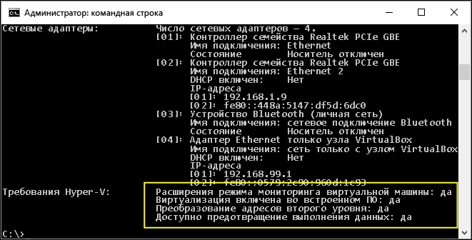

# <a name="windows-10-hyper-v-system-requirements"></a>Требования к системе для Hyper-V в Windows 10

Hyper-V доступен в 64-разрядной версии Windows 10 профессиональная, Корпоративная и для образовательных учреждений. Для Hyper-V требуется функция преобразования адресов второго уровня (SLAT). Она есть в текущем поколении 64-разрядных процессоров Intel и AMD.

На узле, имеющем 4 ГБ оперативной памяти, можно запустить три-четыре базовые виртуальные машины, однако для большего числа виртуальных машин потребуется больше ресурсов. Кроме того, можно создать мощные виртуальные машины с 32 процессорами и 512 ГБ ОЗУ в зависимости от оборудования.

## <a name="operating-system-requirements"></a>Требования к операционной системе

Роль Hyper-V можно включить в таких версиях Windows 10:

- Windows 10 Корпоративная
- Windows 10 Pro
- Windows 10 для образовательных учреждений

Роль Hyper-V **невозможно** установить в следующих версиях:

- Windows 10 Домашняя
- Windows 10 Mobile
- Windows 10 Mobile Корпоративная

>Windows 10 Домашняя версия может быть обновлена до Windows 10 Pro. Для этого перейдите в раздел **Параметры** > **Обновление и безопасность** > **Активация**. Здесь вы можете посетить Магазин Windows и приобрести обновление.

## <a name="hardware-requirements"></a>Требования к оборудованию

Хотя в этом документе не приводится полный список оборудования, совместимого с Hyper-V, укажем следующие обязательные требования:

- 64-разрядный процессор с поддержкой преобразования адресов второго уровня (SLAT).
- Поддержка расширения режима мониторинга виртуальной машины (технология VT-c на компьютерах с процессорами Intel).
- Не менее 4 ГБ оперативной памяти. Так как виртуальные машины и узел Hyper-V используют память совместно, необходимо обеспечить достаточный объем памяти для обработки предполагаемой рабочей нагрузки на виртуальной машине.

В BIOS системы необходимо включить следующие компоненты.
- Virtualization Technology (Технология виртуализации) — может иметь другое название в зависимости от производителя системной платы.
- Hardware Enforced Data Execution Prevention (Принудительное аппаратное предотвращение выполнения данных).

## <a name="verify-hardware-compatibility"></a>Проверка совместимости оборудования

Чтобы проверить совместимость, откройте PowerShell или командную строку (cmd.exe) и введите **systeminfo**. Если все указанные требования Hyper-V имеют значение **Да**, ваша система поддерживает роль Hyper-V. Если хотя бы один элемент имеет значение **Нет**, проверьте указанные выше требования и внесите необходимые изменения.



Если команда **systeminfo** запускается на существующем узле Hyper-V, в разделе Hyper-V Requirements отображается следующее сообщение:

```
Hyper-V Requirements: A hypervisor has been detected. Features required for Hyper-V will not be displayed.
```
