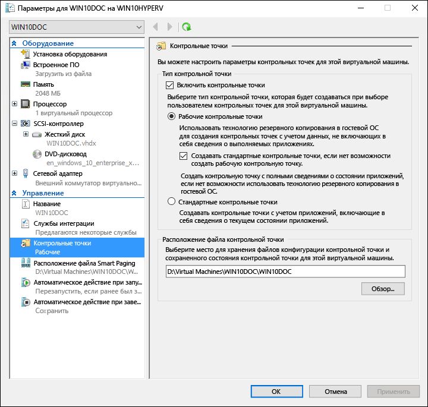
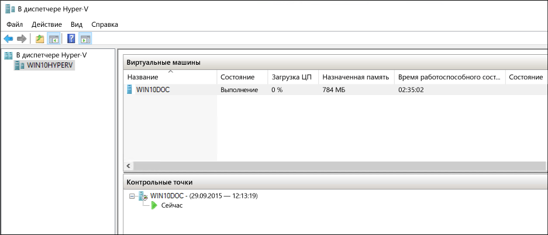
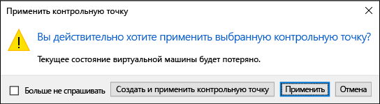
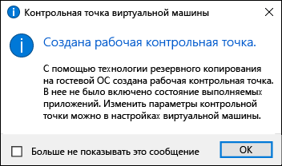

# <a name="using-checkpoints-to-revert-virtual-machines-to-a-previous-state"></a>Восстановление предыдущего состояния виртуальных машин с помощью контрольных точек

Одно из главных преимуществ виртуализации — это возможность сохранять состояние виртуальной машины. В Hyper-V для этого используются контрольные точки виртуальной машины. Контрольную точку виртуальной машины можно создать перед изменением конфигурации программного обеспечения, применением обновления или установкой нового ПО. Если после изменения системы возникла проблема, виртуальную машину можно вернуть в состояние на момент создания контрольной точки.

Hyper-V в Windows 10 включает два типа контрольных точек:

* **Стандартные контрольные точки**: создает моментальный снимок виртуальной машины и состояние памяти виртуальной машины на момент инициации контрольной точки. Моментальный снимок не является полной резервной копией и может приводить к проблемам с согласованностью данных в системах, которые реплицируют данные между различными узлами, например Active Directory.  До Windows 10 Hyper-V предоставлял только стандартные контрольные точки (прежде называвшиеся моментальными снимками).

* **Рабочие контрольные точки**. использует служба теневого копирования томов или замораживание файловой системы на виртуальной машине Linux для создания резервной копии виртуальной машины, обеспечивающей целостность данных. Моментальный снимок состояния памяти для виртуальной машины не создается.

По умолчанию используются рабочие контрольные точки, но с помощью диспетчера Hyper-V или PowerShell это можно изменить.

> **Примечание.** Чтобы контрольная точка и моментальный снимок были взаимозаменяемы, в модуле Hyper-V PowerShell создается несколько псевдонимов.  
  В этом документе используется термин "контрольная точка", но в аналогичных командах также может использоваться термин "моментальный снимок".

## <a name="changing-the-checkpoint-type"></a>Изменение типа контрольных точек

**Использование диспетчера Hyper-V**

1. Откройте диспетчер Hyper-V.
2. Щелкните правой кнопкой мыши виртуальную машину и выберите **Параметры**.
3. В разделе "Управление" выберите **Контрольные точки**.
4. Выберите необходимый тип контрольной точки.

<br />



**Использование PowerShell**

Чтобы изменить контрольную точку с помощью PowerShell, можно использовать следующие команды: 

Задать стандартную контрольную точку:
```powershell
Set-VM -Name <vmname> -CheckpointType Standard
```

Задать рабочую контрольную точку. При сбое рабочей контрольной точки создается стандартная контрольная точка:
```powershell
Set-VM -Name <vmname> -CheckpointType Production
```

Задать рабочую контрольную точку. При сбое рабочей контрольной точки стандартная контрольная точка не создается. 
```powershell
Set-VM -Name <vmname> -CheckpointType ProductionOnly
```

## <a name="creating-checkpoints"></a>Создание контрольных точек

Создает контрольную точку того типа, который настроен для данной виртуальной машины. Сведения о том, как изменить тип контрольной точки, см. в разделе [Изменение типа контрольной точки](checkpoints.md#changing-the-checkpoint-type) (выше в этом же документе).

**Использование диспетчера Hyper-V**

Чтобы создать контрольную точку, выполните указанные ниже действия.  
1. В диспетчере Hyper-V выберите нужную виртуальную машину.
2. Щелкните имя виртуальной машины правой кнопкой мыши и выберите пункт **Контрольная точка**.
3. По завершении процесса контрольная точка будет отображаться в разделе **Контрольные точки** **диспетчера Hyper-V**.

**Использование PowerShell**

Создайте контрольную точку с помощью команды **CheckPoint-VM**.  

```powershell
Checkpoint-VM -Name <VMName>
```

После создания просмотрите список контрольных точек виртуальной машины с помощью команды **Get-VMCheckpoint**.

```powershell
Get-VMCheckpoint -VMName <VMName>
```

## <a name="applying-checkpoints"></a>Применение контрольных точек

Если вы хотите вернуть виртуальную машину в состояние на определенный момент времени, примените существующую контрольную точку.

**Использование диспетчера Hyper-V**

1. В разделе **Виртуальные машины** **диспетчера Hyper-V** выберите виртуальную машину.
2. В разделе "Контрольные точки" щелкните правой кнопкой мыши контрольную точку, которую хотите использовать, и выберите пункт **Применить**.
3. Появится диалоговое окно со следующими параметрами:  
  * **Создать и применить контрольную точку**: создает новую контрольную точку виртуальной машины до применения более ранней контрольной точки. 
  * **Применить**: применяет только выбранную контрольную точку. Это действие нельзя отменить.
  * **Отменить**: закрывает диалоговое окно, не выполняя никаких действий.
  
  Выберите один из вариантов применения для создания и применения контрольной точки.

**Использование PowerShell**

5. Чтобы просмотреть список контрольных точек виртуальной машины, выполните команду **Get-VMCheckpoint**.

    ```powershell
    Get-VMCheckpoint -VMName <VMName>
    ```
6. Чтобы применить контрольную точку, выполните команду **Restore-VMCheckpoint**.

    ```powershell
    Restore-VMCheckpoint -Name <checkpoint name> -VMName <VMName> -Confirm:$false
    ```

## <a name="renaming-checkpoints"></a>Переименование контрольных точек

В определенной точке могут быть созданы много контрольных точек.  Предоставление им понятного имени упрощает запоминание сведений о состоянии системы при создании контрольной точки.

По умолчанию имя контрольной точки — имя виртуальной машины в сочетании с указанием даты и времени создания контрольной точки. Стандартный формат: 

```
virtual_machine_name (MM/DD/YYY -hh:mm:ss AM\PM)
```

Имя должно содержать не более 100 знаков и не может быть пустым. 

**Использование диспетчера Hyper-V**

1. В **диспетчере Hyper-V** выберите виртуальную машину.
2. Щелкните правой кнопкой мыши контрольную точку и выберите команду **Переименовать**.
3. Введите новое имя для контрольной точки. Длина этого имени не должна превышать 100 знаков. Поле не может быть пустым.
4. По завершении нажмите клавишу **ВВОД**.

**Использование PowerShell**

``` powershell
Rename-VMCheckpoint -VMName <virtual machine name> -Name <checkpoint name> -NewName <new checkpoint name>
```

## <a name="deleting-checkpoints"></a>Удаление контрольных точек

Удаление контрольных точек помогает освободить пространство на узле Hyper-V.

Контрольные точки хранятся в виде AVHDX-файлов в том же расположении, что и VHDX-файлы для виртуальной машины. При удалении контрольной точки Hyper-V для удобства объединяет AVHDX- и VHDX-файлы.  После завершения AVHDX-файл данной контрольной точки будет удален из файловой системы. 

Не следует удалять непосредственно AVHDX-файлы.
 
**Использование диспетчера Hyper-V**

Чтобы полностью удалить контрольную точку: 

1. В **диспетчере Hyper-V** выберите виртуальную машину.
2. В разделе **контрольные точки** щелкните правой кнопкой мыши контрольную точку, которую необходимо удалить, и выберите команду Удалить. Можно также удалить контрольную точку и все последующие контрольные точки. Для этого щелкните правой кнопкой мыши самую раннюю контрольную точку, которую хотите удалить, и выберите элемент ***Удалить поддерево**контрольных точек**.
3. Возможно, вам будет предложено подтвердить удаление контрольной точки. Убедитесь, что выбрана правильная контрольная точка и выберите элемент **Удалить**. 
 
**Использование PowerShell**
```powershell
Remove-VMCheckpoint -VMName <virtual machine name> -Name <checkpoint name>
```

## <a name="exporting-checkpoints"></a>Экспорт контрольных точек

Экспорт объединяет контрольные точки в пакет как виртуальную машину, так что контрольную точку можно переместить в новое место. После выполнения импорта контрольная точка восстанавливается как виртуальная машина. Экспортированные контрольные точки можно использовать для резервного копирования.

**Использование PowerShell**
``` powershell
Export-VMCheckpoint -VMName <virtual machine name> -Name <checkpoint name> -Path <path for export>
```

## <a name="enable-or-disable-checkpoints"></a>Включение и отключение контрольных точек

1. В **диспетчере Hyper-V** щелкните имя виртуальной машины правой кнопкой мыши и выберите **Параметры**.
2. В разделе **Управление** выберите элемент **Контрольные точки**.
3. Чтобы разрешить создание контрольных точек для этой виртуальной машины, установите флажок "Включить контрольные точки". Это поведение по умолчанию.  
Чтобы отключить контрольные точки, снимите флажок **Включить контрольные точки**.
4. Выберите элемент **Применить**, чтобы применить внесенные изменения. После этого нажмите кнопку **ОК**, чтобы закрыть диалоговое окно.

## <a name="configure-checkpoint-location"></a>Настройка расположения контрольной точки

Если у виртуальной машины нет контрольных точек, можно изменить место, в котором хранятся файлы конфигурации контрольных точек и файлы состояний сохранения.

1. В **диспетчере Hyper-V** щелкните имя виртуальной машины правой кнопкой мыши и выберите **Параметры**.
2. В разделе **Управление** выберите **Контрольные точки** или **Расположение файла контрольной точки**.
4. В окне **Расположение файла контрольной точки** введите путь к папке, где вы хотите хранить файлы.
5. Выберите элемент **Применить**, чтобы применить внесенные изменения. После этого нажмите кнопку **ОК**, чтобы закрыть диалоговое окно.

По умолчанию для хранения файлов конфигурации контрольных точек используется расположение: `%systemroot%\ProgramData\Microsoft\Windows\Hyper-V\Snapshots`.


<!-- This belongs in dev docs

This folder will contain the .VMRS file with the runtime and saved state data and a .VMCX configuration file, which uses the checkpoint GUID as the file name.
-->

## <a name="checkpoint-demo"></a>Демонстрация контрольной точки

В следующем упражнении вы научитесь создавать и применять стандартную и рабочую контрольные точки.  В этом примере вы внесете простое изменение в виртуальную машину и увидите изменение ее поведения. 

### <a name="standard-checkpoint"></a>Стандартная контрольная точка

1. Войдите в виртуальную машину и создайте текстовый файл на рабочем столе.
2. Откройте файл в Блокноте и введите текст "Это стандартная контрольная точка". **Не сохраняйте файл и не закрывайте Блокнот**.  
3. Инструкции по изменению контрольной точки на стандартную см. [здесь](checkpoints.md#changing-the-checkpoint-type).
4. Создание новой контрольной точки.

<br />

 

**Применение стандартной контрольной точки с помощью диспетчера Hyper-V**

Теперь, когда контрольная точка создана, внесите изменения в виртуальную машину, а затем примените контрольную точку, чтобы вернуть виртуальную машину в сохраненное состояние. 

1. Закройте текстовый файл, если он по-прежнему открыт, и удалите его с рабочего стола виртуальной машины.
2. Откройте диспетчер Hyper-V, щелкните правой кнопкой мыши стандартную контрольную точку и выберите пункт "Применить".
3. В диалоговом окне "Применить контрольную точку" нажмите кнопку "Применить".

<br />

 

Обратите внимание, что после применения контрольной точки восстановлен не только текстовый файл, но и состояние системы на момент создания контрольной точки. В этом случае Блокнот будет открыт с загруженным текстовым файлом.

### <a name="production-checkpoint"></a>Рабочая контрольная точка

Теперь рассмотрим рабочие контрольные точки. Эта процедура почти идентична работе со стандартными контрольными точками, но имеет немного другие результаты. Перед началом работы убедитесь, что у вас есть виртуальная машина и выбран рабочий тип контрольной точки.

**Изменение виртуальной машины и создание рабочей контрольной точки**

1. Войдите в виртуальную машину и создайте текстовый файл. Если вы использовали Предыдущее упражнение, можно использовать существующий текстовый файл.
2. В этом файле введите текст "Это рабочая контрольная точка", сохраните его, но **не закрывайте Блокнот**.
3. Откройте диспетчер Hyper-V, щелкните правой кнопкой мыши виртуальную машину и выберите **контрольная точка**.
4. В окне "Создана рабочая контрольная точка" нажмите кнопку **ОК**.

<br />

 

**Применение рабочей контрольной точки с помощью диспетчера Hyper-V**

Теперь, когда контрольная точка создана, внесите изменения в систему, а затем примените контрольную точку, чтобы возвратить виртуальную машину в сохраненное состояние. 

1. Закройте текстовый файл, если он по-прежнему открыт, и удалите его с рабочего стола виртуальной машины.
2. Откройте диспетчер Hyper-V, щелкните правой кнопкой мыши рабочую контрольную точку и выберите **Применить**.
3. В диалоговом окне "Применить контрольную точку" нажмите кнопку **Применить**.

Обратите внимание, что после применения рабочей контрольной точки виртуальная машина отключается.

1. Запустите виртуальную машину и войдите в систему.
2. Обратите внимание, что текстовый файл восстановлен, но, в отличие от стандартной контрольной точки, Блокнот закрыт.   
