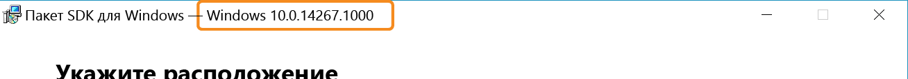

# Создайте собственные службы интеграции

Начиная с ОС Windows 10, любой пользователь может создать службу, практически аналогичную встроенным службам интеграции Hyper-V, с помощью нового канала связи на основе сокетов между узлом Hyper-V и запущенными на нем виртуальными машинами.  С помощью этих сокетов Hyper-V службы могут работать независимо от сетевого стека и все данные остаются в той же физической памяти.

В этой статье приведены пошаговые инструкции по созданию простого приложения, созданного на сокетах Hyper-V, и началу работы.

[PowerShell Direct](../user_guide/vmsession.md) — это пример приложения (в данном случае службы, поставляемой с Windows), использующего для связи сокеты Hyper-V.

**Поддерживаемые операционные системы узла**
* Сборка 14290 системы Windows 10 и более поздние сборки
* Windows Server Technical Preview 4 и более поздние версии
* Будущие выпуски (Server 2016 +)

**Поддерживаемые гостевые операционные системы**
* Windows 10
* Windows Server Technical Preview 4 и более поздние версии
* Будущие выпуски (Server 2016 +)
* Гости Linux со службами Linux Integration Services (см. статью [Supported Linux and FreeBSD virtual machines for Hyper-V on Windows](https://technet.microsoft.com/library/dn531030(ws.12).aspx) (Поддерживаемые виртуальные машины Linux и FreeBSD для Hyper-V в Windows))

**Возможности и ограничения**  
* Поддержка режима ядра или действий в режиме пользователя  
* Только поток данных      
* Нет блочной памяти (не подходит для резервного копирования и видео)   

--------------

## Начало работы
В настоящий момент сокеты Hyper-V доступны в виде машинного кода (C/C++).  

Чтобы написать простое приложение, вам понадобится следующее:
* Компилятор C.  Если у вас его нет, перейдите в [сообщество Visual Studio](https://aka.ms/vs)
* Компьютер, на котором работают Hyper-V и виртуальная машина.  
  * В качестве гостевой операционной системы (виртуальная машина) и ОС узла должна использоваться Windows 10, Windows Server Technical Preview 3 или более поздней версии.
* [Пакет SDK для Windows 10](http://aka.ms/flightingSDK) установлен на узле Hyper-V

**Сведения о Windows SDK**

Ссылки на пакет SDK для Windows:
* [Пакет SDK для Windows 10 — предварительная версия для участников программы предварительной оценки](http://aka.ms/flightingSDK)
* [Пакет SDK для Windows 10](https://dev.windows.com/en-us/downloads/windows-10-sdk)

Интерфейс API для сокетов Hyper-V стал доступен в Windows 10, начиная со сборки 14290, — скачиваемые файлы фокус-тестирования соответствуют последней сборке фокус-тестирования для инсайдеров.  
При непредвиденном поведении сообщите нам через [форум TechNet](https://social.technet.microsoft.com/Forums/windowsserver/en-US/home "TechNet Forums").  В сообщение включите следующее.
* Описание непредвиденного поведения. 
* Номера ОС и сборки для узла, виртуальной машины и пакета SDK.  
  
  Номер сборки пакета SDK отображается в заголовке установщика для пакета SDK:  
  


## Регистрация нового приложения
Чтобы использовать сокеты Hyper-V, необходимо зарегистрировать приложение в реестре узла Hyper-V.

Зарегистрировав службу в реестре, вы получите:
*  Управление WMI для включения, отключения и отображения списка доступных служб
*  Разрешение на прямую связь с виртуальными машинами

Следующая команда PowerShell регистрирует новое приложение с именем HV Socket Demo.  Ее необходимо выполнять от имени администратора.  Инструкции по регистрации вручную приведены ниже.

``` PowerShell
$friendlyName = "HV Socket Demo"

# Create a new random GUID and add it to the services list then add the name as a value

$service = New-Item -Path "HKLM:\SOFTWARE\Microsoft\Windows NT\CurrentVersion\Virtualization\GuestCommunicationServices" -Name ((New-Guid).Guid)

$service.SetValue("ElementName", $friendlyName)

# Copy GUID to clipboard for later use
$service.PSChildName | clip.exe
```

** Расположение и данные реестра **  

``` 
HKEY_LOCAL_MACHINE\SOFTWARE\Microsoft\Windows NT\CurrentVersion\Virtualization\GuestCommunicationServices\
```  
В этом расположении реестра есть несколько кодов GUID.  Это и есть службы, поставляемые с Windows.

Сведения в реестре для каждой службы:
* `Service GUID`   
    * `ElementName (REG_SZ)` — понятное имя службы

Чтобы зарегистрировать свою службу, создайте раздел реестра, используя свой код GUID и понятное имя.

Понятное имя будет связано с новым приложением.  Оно будет отображаться в счетчиках производительности и других местах, где невозможно использовать код GUID.

Запись реестра будет выглядеть следующим образом:
```
HKEY_LOCAL_MACHINE\SOFTWARE\Microsoft\Windows NT\CurrentVersion\Virtualization\GuestCommunicationServices\
    999E53D4-3D5C-4C3E-8779-BED06EC056E1\
        ElementName REG_SZ  VM Session Service
    YourGUID\
        ElementName REG_SZ  Your Service Friendly Name
```

> **Совет.** Чтобы создать GUID в PowerShell и скопировать его в буфер обмена, используйте следующую команду:  
``` PowerShell
(New-Guid).Guid | clip.exe
```

## Создание сокета Hyper-V

В большинстве случаев, чтобы определить сокет, требуется семейство адресов, тип соединения и протокол.

Вот простое [определение сокета](
https://msdn.microsoft.com/en-us/library/windows/desktop/ms740506(v=vs.85).aspx
)

``` C
SOCKET WSAAPI socket(
  _In_ int af,
  _In_ int type,
  _In_ int protocol
);
``` 

Для сокета Hyper-V:
* Семейство адресов — `AF_HYPERV`
* Тип — `SOCK_STREAM`
* Протокол — `HV_PROTOCOL_RAW`


Пример объявления или создания экземпляра:  
``` C
SOCKET sock = socket(AF_HYPERV, SOCK_STREAM, HV_PROTOCOL_RAW);
```


## Привязка к сокету Hyper-V

Привязка связывает сокет со сведениями о подключении.

Определение этой функции скопировано ниже для удобства. Подробнее о привязке см. [здесь](https://msdn.microsoft.com/en-us/library/windows/desktop/ms737550.aspx).

``` C
int bind(
  _In_ SOCKET                s,
  _In_ const struct sockaddr *name,
  _In_ int                   namelen
);
```

В отличие от адреса сокета (sockaddr) для стандартного семейства адресов протокола IP (`AF_INET`), который состоит из IP-адреса хост-компьютера и номера порта на этом узле, адрес сокета для `AF_HYPERV` использует для подключения идентификатор виртуальной машины и описанный выше идентификатор приложения. 

Так как сокеты Hyper-V не зависят от сетевого стека, TCP/IP, DNS и т. д., для конечной точки сокета требуется формат, не использующий протокол IP и имя узла, но однозначно описывающий подключение.

Вот определение адреса сокета Hyper-V:

``` C
struct SOCKADDR_HV
{
     ADDRESS_FAMILY Family;
     USHORT Reserved;
     GUID VmId;
     GUID ServiceId;
};
```

Вместо протокола IP или имени узла конечные точки AF_HYPERV используют два кода GUID:  
* ИД ВМ — это уникальный идентификатор виртуальной машины.  Его можно узнать с помощью следующего фрагмента кода PowerShell.  
  ```PowerShell
  (Get-VM -Name $VMName).Id
  ```
* Идентификатор службы — код GUID, [описанный выше](#RegisterANewApplication), под которым приложение зарегистрировано в реестре узла Hyper-V.

Кроме того, для идентификатора виртуальной машины доступен ряд подстановочных знаков.
 
### Подстановочные знаки для идентификатора виртуальной машины

| Название | Код GUID | Описание |
|:-----|:-----|:-----|
| HV_GUID_ZERO | 00000000-0000-0000-0000-000000000000 | Прослушиватели необходимо привязать к этому идентификатору виртуальной машины, чтобы принимать подключения от всех разделов. |
| HV_GUID_WILDCARD | 00000000-0000-0000-0000-000000000000 | Прослушиватели необходимо привязать к этому идентификатору виртуальной машины, чтобы принимать подключения от всех разделов. |
| HV_GUID_BROADCAST | FFFFFFFF-FFFF-FFFF-FFFF-FFFFFFFFFFFF | |  
| HV_GUID_CHILDREN | 90db8b89-0d35-4f79-8ce9-49ea0ac8b7cd | Адрес из подстановочных знаков для дочерних элементов. Прослушиватели необходимо привязать к этому идентификатору виртуальной машины, чтобы принимать подключения от дочерних элементов. |
| HV_GUID_LOOPBACK | e0e16197-dd56-4a10-9195-5ee7a155a838 | Петлевой адрес. При использовании этого адреса выполняется подключение к разделу соединителя. |
| HV_GUID_PARENT | a42e7cda-d03f-480c-9cc2-a4de20abb878 | Адрес родительского элемента. При использовании этого адреса выполняется подключение к родительскому разделу соединителя*. |


***HV_GUID_PARENT**  
Родительский элемент виртуальной машины — это ее узел.  Родительский элемент контейнера — это узел контейнера.  
При подключении из контейнера, запущенного в виртуальной машине, будет выполнено подключение к виртуальной машине, в которой размещен контейнер.  
Прослушивание на этом идентификаторе виртуальной машины принимает подключение от:  
(В контейнерах): узла контейнера.  
(В виртуальной машине: узел контейнера или без контейнера): узла виртуальной машины.  
(Не в виртуальной машине: узел контейнера или без контейнера): не поддерживается.

## Поддерживаемые команды сокета

Socket()  
Bind()  
Connect()  
Send()  
Listen()  
Accept()  

[Полный API WinSock](https://msdn.microsoft.com/en-us/library/windows/desktop/ms741394.aspx)

## Проблемы и их решение
Плавное отключение, метод select


<!--HONumber=Oct16_HO4-->


