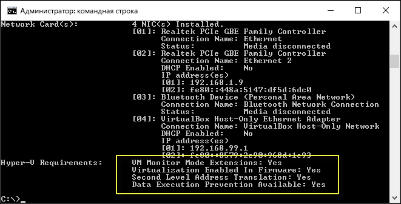

# Требования к системе для Hyper-V в Windows 10

Hyper-V в Windows 10 работает только с определенными конфигурациями оборудования и операционных систем. Этот документ описывает требования Hyper-V и проверку системы на предмет совместимости.

## Требования к операционной системе

Роль Hyper-V можно включить в таких версиях Windows 10:

- Windows 10 Корпоративная
- Windows 10 Профессиональная
- Windows 10 для образовательных учреждений

Роль Hyper-V **невозможно** установить в следующих версиях:

- Windows 10 Домашняя
- Windows 10 Mobile
- Windows 10 Mobile Корпоративная

>ОС Windows 10 Домашняя можно обновить до версии Windows 10 Профессиональная. Для этого перейдите в раздел **Параметры** > **Обновление и безопасность** > **Активация**. Здесь вы можете посетить Магазин Windows и приобрести обновление.

## Требования к оборудованию

Хотя в этом документе не приводится полный список оборудования, совместимого с Hyper-V, укажем следующие обязательные требования:
    
- 64-разрядный процессор с поддержкой преобразования адресов второго уровня (SLAT).
- Поддержка расширения режима мониторинга виртуальной машины (технология VT-c на компьютерах с процессорами Intel).
- Не менее 4 ГБ оперативной памяти. Так как виртуальные машины и узел Hyper-V используют память совместно, необходимо обеспечить достаточный объем памяти для обработки предполагаемой рабочей нагрузки на виртуальной машине.

В BIOS системы необходимо включить следующие компоненты.
- Virtualization Technology (Технология виртуализации) — может иметь другое название в зависимости от производителя системной платы.
- Hardware Enforced Data Execution Prevention (Принудительное аппаратное предотвращение выполнения данных).

## Проверка совместимости оборудования

Чтобы проверить совместимость, откройте PowerShell или командную строку (cmd.exe) и введите **systeminfo.exe**. Если все указанные требования Hyper-V имеют значение **Да**, ваша система поддерживает роль Hyper-V. Если хотя бы один элемент имеет значение **Нет**, проверьте указанные выше требования и внесите необходимые изменения.



Если команда **systeminfo.exe** выполняется на существующем узле Hyper-V, в разделе "Требования Hyper-V" отображается следующее сообщение:

```
Hyper-V Requirements: A hypervisor has been detected. Features required for Hyper-V are not be displayed.
```

## Далее: установка Hyper-V
[Установка Hyper-V](walkthrough_install.md)


<!--HONumber=Oct16_HO4-->


