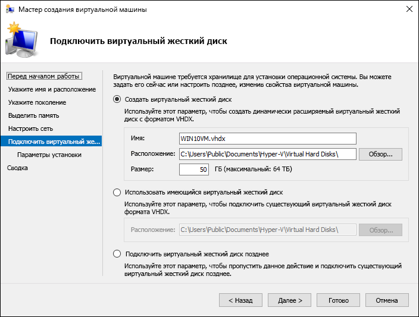
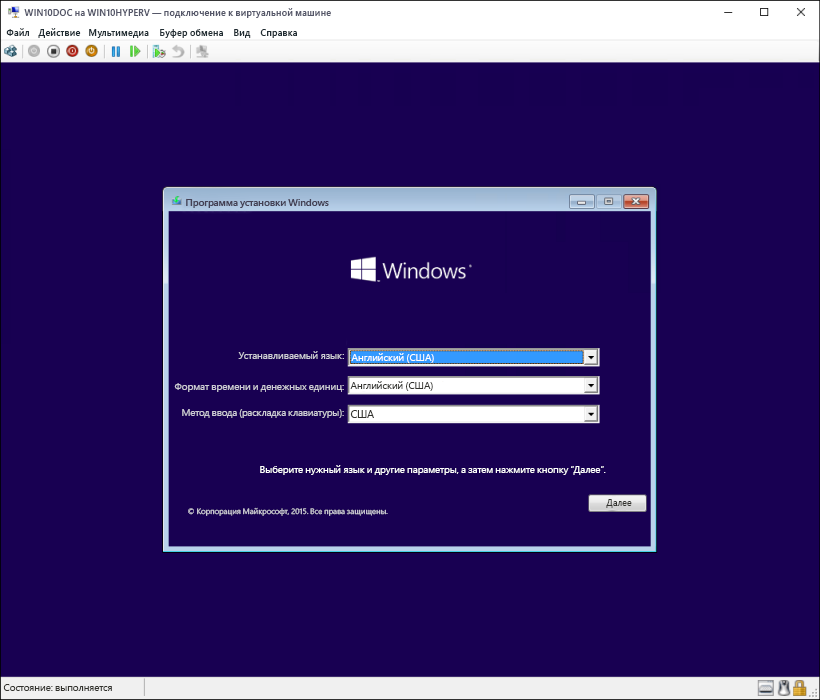

# Развертывание виртуальной машины Windows с использованием Hyper-V в Windows 10

Можно создать виртуальную машину и развернуть на ней операционную систему различными способами. Например, с помощью служб развертывания Windows, установочного носителя (вручную) или подключения подготовленного виртуального жесткого диска. В этой статье рассматриваются способы создания виртуальной машины и развертывания на ней операционной системы с помощью установочного носителя операционной системы.

Для выполнения этого упражнения требуется ISO-файл для операционной системы, которую вы желаете развернуть. При необходимости пробную версию ОС Windows 8.1 или Windows 10 можно получить в [Центре TechNet Evaluation Center](http://www.microsoft.com/en-us/evalcenter/).

## Создание виртуальной машины с помощью диспетчера Hyper-V
Ниже описано, как вручную создать виртуальную машину и развернуть на ней операционную систему.

1. В диспетчере Hyper-V щелкните **Действие** > **Создать** > **Виртуальная машина**, чтобы открыть мастер создания виртуальной машины.

2. Просмотрите содержимое страницы "Приступая к работе" и нажмите кнопку **Далее**. 

3. Присвойте имя виртуальной машине.
  > **Примечание.** Это имя, используемое Hyper-V для виртуальной машины, а не имя компьютера, присвоенное гостевой операционной системе, которая будет развернута внутри виртуальной машины.

4. Выберите расположение, где будут храниться файлы виртуальной машины (например, **c:\virtualmachine**). Можно также оставить расположение по умолчанию. По завершении нажмите кнопку **Далее**.
    
  

5. Выберите поколение виртуальной машины и нажмите кнопку **Далее**.  

  В виртуальных машинах поколения 2, которые появились в Windows Server 2012 R2, доступна упрощенная модель виртуального оборудования и некоторые дополнительные функциональные возможности. На виртуальную машину поколения 2 можно установить только 64-разрядную версию операционной системы. Дополнительные сведения о виртуальных машинах поколения 2 см. в статье [Generation 2 Virtual Machine Overview](https://technet.microsoft.com/en-us/library/dn282285.aspx) (Обзор виртуальных машин поколения 2).
  
  > Если новая виртуальная машина относится к поколению 2 и будет работать под управлением дистрибутива Linux, потребуется отключить безопасную загрузку. Дополнительные сведения о безопасной загрузке см. в статье [Безопасная загрузка](https://technet.microsoft.com/en-us/library/dn486875.aspx).

6. Выберите **2048** МБ в качестве значения параметра **Память, выделяемая при запуске** и не снимайте флажок **Использовать динамическую память**. Нажмите кнопку **Далее**.  

  Память распределяется между узлом Hyper-V и виртуальной машиной, работающей на этом узле. Число виртуальных машин, которые могут работать на одном узле, зависит, в частности, от объема доступной памяти. Виртуальную машину можно также настроить для использования динамической памяти. При включении динамическая память высвобождает неиспользуемую память работающей виртуальной машины. Это позволяет большему количеству виртуальных машин работать на узле. Дополнительные сведения о динамической памяти см. в статье [Общие сведения о динамической памяти в Hyper-V](https://technet.microsoft.com/en-us/library/hh831766.aspx).

7. В мастере настройки сети выберите для данной виртуальной машины виртуальный коммутатор и нажмите кнопку **Далее**. Дополнительные сведения см. в статье [Создание виртуального коммутатора](walkthrough_virtual_switch.md).

8. Присвойте имя виртуальному жесткому диску, выберите расположение или оставьте значение по умолчанию, а затем укажите размер. По окончании нажмите кнопку **Далее**.

  Виртуальный жесткий диск представляет собой память для виртуальной машины, чем напоминает физический жесткий диск. Виртуальный жесткий диск требуется для установки операционной системы на виртуальной машине.
  
    

9. В мастере параметров установки выберите элемент **Установить операционную систему из файла загрузочного образа**, а затем выберите ISO-файл нужной операционной системы. Нажмите кнопку **Далее** после завершения.

  При создании виртуальной машины можно настроить некоторые параметры установки операционной системы. Доступны три варианта.

  - **Установить операционную систему позднее**. Этот параметр не вносит какие-либо дополнительные изменения в виртуальную машину.

  - **Установить операционную систему из файла загрузочного образа**. Действие этого параметра аналогично вставке компакт-диска в физический дисковод компьютера. Чтобы настроить этот параметр, выберите ISO-образ. Этот образ будет подключен к дисководу виртуальной машины. Меняется порядок загрузки виртуальной машины: загрузка начинается с дисковода.

  - **Установить операционную систему с сетевого сервера установки**. Этот параметр доступен только тогда, когда виртуальная машина подключена к сетевому коммутатору. В этой конфигурации виртуальная машина предпринимает попытки загрузиться из сети.
  
10. Просмотрите информацию о данной виртуальной машине и нажмите кнопку **Готово** для завершения создания виртуальной машины.

## Создание виртуальной машины с помощью PowerShell

1. Откройте интегрированную среду сценариев PowerShell от имени администратора.

2. Выполните следующий скрипт.

  ```powershell
  # Set VM Name, Switch Name, and Installation Media Path.
  $VMName = 'TESTVM'
  $Switch = 'External VM Switch'
  $InstallMedia = 'C:\Users\Administrator\Desktop\en_windows_10_enterprise_x64_dvd_6851151.iso'
  
  # Create New Virtual Machine
  New-VM -Name $VMName -MemoryStartupBytes 2147483648 -Generation 2 -NewVHDPath "D:\Virtual Machines\$VMName\$VMName.vhdx" -NewVHDSizeBytes 53687091200 -Path "D:\Virtual Machines\$VMName" -SwitchName $Switch
  
  # Add DVD Drive to Virtual Machine
  Add-VMScsiController -VMName $VMName
  Add-VMDvdDrive -VMName $VMName -ControllerNumber 1 -ControllerLocation 0 -Path $InstallMedia
  
  # Mount Installation Media
  $DVDDrive = Get-VMDvdDrive -VMName $VMName
  
  # Configure Virtual Machine to Boot from DVD
  Set-VMFirmware -VMName $VMName -FirstBootDevice $DVDDrive
  ```
  
## Завершение развертывания операционной системы

Чтобы завершить создание виртуальной машины, необходимо ее запустить и выполнить пошаговые инструкции по установке операционной системы.

1. В диспетчере Hyper-V дважды щелкните виртуальную машину. Запустится средство VMConnect.

2. В VMConnect нажмите зеленую кнопку "Пуск". Это аналогично нажатию кнопки питания на физическом компьютере. Нажмите любую клавишу для загрузки с компакт- или DVD-диска при появлении соответствующего запроса.
  > **Примечание.** Чтобы убедиться, что нажатия клавиш отправляются в виртуальную машину, щелкните внутри окна VMConnect.

3. Виртуальная машина загрузится для установки, и можно будет выполнить пошаговую установку аналогично процедуре на физическом компьютере.

   

> **Примечание.** Если вы не используете корпоративную лицензию на Windows, требуется отдельная лицензия для Windows, установленная в виртуальной машине. ОС виртуальной машины не зависит от операционной системы сервера виртуальных машин.

## Следующий этап — работа с Hyper-V и PowerShell
[Hyper-V и Windows PowerShell](walkthrough_powershell.md)


<!--HONumber=Jun16_HO4-->


