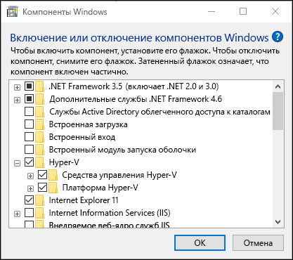
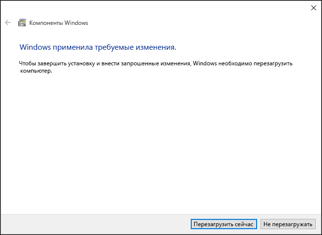
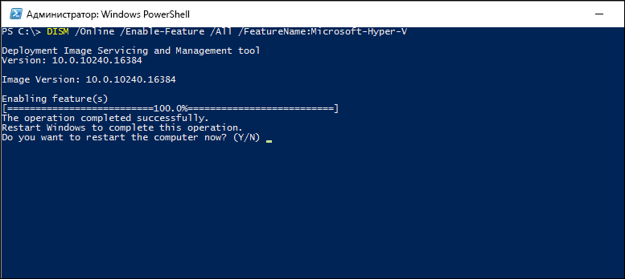

# Установка Hyper-V в Windows 10

Чтобы создавать виртуальные машины в ОС Windows 10, необходимо включить роль Hyper-V. Это можно сделать с помощью панели управления Windows 10, PowerShell или средства обслуживания образов развертывания и управления ими (DISM). В этом документе последовательно описан каждый из указанных способов.

> Перед включением Hyper-V убедитесь в совместимости вашей системы. Дополнительные сведения см. в статье [Требования к системе для Hyper-V в Windows 10](https://msdn.microsoft.com/virtualization/hyperv_on_windows/quick_start/walkthrough_compatibility).

## Установка роли Hyper-V вручную

1. Щелкните правой кнопкой мыши кнопку Windows и выберите пункт "Программы и компоненты".

2. Выберите пункт **Включение или отключение компонентов Windows**.

3. Выберите **Hyper-V** и нажмите кнопку **ОК**.



После завершения установки вам будет предложено перезапустить компьютер.



## Установка Hyper-V с помощью PowerShell

1. Откройте консоль PowerShell от имени администратора.

2. Выполните следующую команду.

```powershell
Enable-WindowsOptionalFeature -Online -FeatureName Microsoft-Hyper-V -All
```
После завершения установки необходимо перезагрузить компьютер.

## Установка Hyper-V с помощью DISM

Средство обслуживания образов развертывания и управления ими, или DISM, используется для обслуживания образов Windows и подготовки сред предварительной установки Windows. DISM позволяет также включать компоненты Windows во время работы операционной системы. Дополнительные сведения см. в [техническом справочнике по DISM](https://technet.microsoft.com/en-us/library/hh824821.aspx).

Чтобы включить роль Hyper-V с помощью DISM, выполните указанные ниже действия.

1. Запустите PowerShell или сеанс CMD от имени администратора.

2. Введите следующую команду:

```powershell
DISM /Online /Enable-Feature /All /FeatureName:Microsoft-Hyper-V
```



## Следующий шаг — создание виртуального коммутатора

[Создание виртуального коммутатора](walkthrough_virtual_switch.md)


<!--HONumber=Feb16_HO4-->


