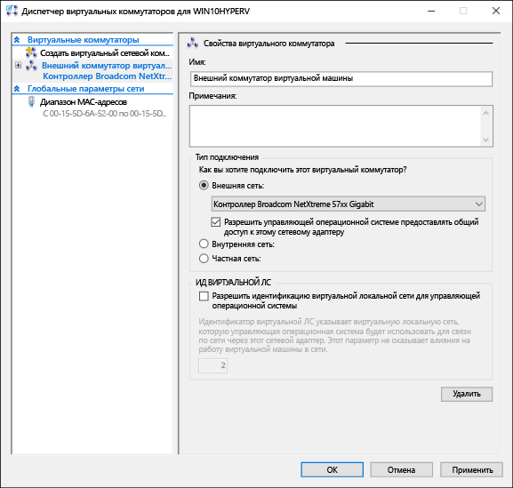
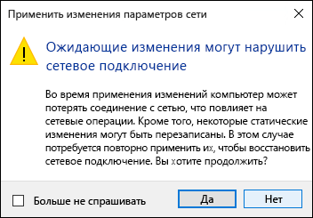

# Создание виртуального коммутатора

Перед созданием виртуальной машины в Hyper-V необходимо указать способ подключения этой виртуальной машины к физической сети. Hyper-V включает программную сетевую технологию, позволяющую сетевому адаптеру виртуальных машин подключаться к виртуальному коммутатору, предоставляя возможность подключения к сети. Каждый виртуальный коммутатор, созданный в Hyper-V, можно настроить с помощью одного из трех типов подключения, описанных ниже.

- **Внешняя сеть** — виртуальный коммутатор подключен к физическому сетевому адаптеру, который позволяет устанавливать подключение между физической сетью, узлом Hyper-V и виртуальной машиной. В такой конфигурации можно также включить или отключить возможность узлов обмениваться данными по сетевому адаптеру с физическим подключением. Это может быть полезно для изоляции трафика виртуальных машин в определенном физическом сетевом адаптере.

- **Внутренняя сеть** — виртуальный коммутатор не подключен к физическому сетевому адаптеру, но между виртуальными машинами и узлом Hyper-V установлено сетевое подключение.

- **Частная сеть** — виртуальный коммутатор не подключен к физическому сетевому адаптеру, а между виртуальными машинами и узлом Hyper-V не установлено подключение.

## Создание виртуального коммутатора вручную

В рамках этого упражнения рассматривается создание внешнего виртуального коммутатора с помощью диспетчера управления Hyper-V. После завершения этого упражнения узел Hyper-V будет содержать виртуальный коммутатор, который можно использовать для подключения виртуальных машин к физической сети.

1. Откройте диспетчер Hyper-V.

2. Щелкните имя узла Hyper-V правой кнопкой мыши и выберите **Диспетчер виртуальных коммутаторов**.

3. В разделе "Виртуальные коммутаторы" выберите **новый виртуальный сетевой коммутатор**.

4. В разделе "Создать виртуальный коммутатор" выберите пункт **Внешний**.

5. Нажмите кнопку **Создать виртуальный коммутатор**.

6. В разделе "Свойства виртуального коммутатора" присвойте новому коммутатору имя, например **Внешний коммутатор виртуальных машин**.

7. Убедитесь, что в разделе "Тип подключения" выбран параметр **Внешняя сеть**.

8. Выберите физический сетевой адаптер для связывания с новым виртуальным коммутатором. Этот сетевой адаптер физически подключен к сети.

    

9. Щелкните **Применить**, чтобы создать виртуальный коммутатор. На этом этапе, скорее всего, появится приведенное ниже сообщение. Щелкните **Да**, чтобы продолжить.

    

10. Щелкните **ОК**, чтобы закрыть окно диспетчера виртуальных коммутаторов.

## Создание виртуального коммутатора с помощью PowerShell

Чтобы создать виртуальный коммутатор с внешним подключением с помощью PowerShell:

1. Используйте командлет **Get-NetAdapter**, чтобы получить список сетевых адаптеров, подключенных к системе Windows 10.

    ```powershell
    PS C:\> Get-NetAdapter
    
    Name                      InterfaceDescription                    ifIndex Status       MacAddress             LinkSpeed
    ----                      --------------------                    ------- ------       ----------             ---------
    Ethernet 2                Broadcom NetXtreme 57xx Gigabit Cont...       5 Up           BC-30-5B-A8-C1-7F         1 Gbps
    Ethernet                  Intel(R) PRO/100 M Desktop Adapter            3 Up           00-0E-0C-A8-DC-31        10 Mbps  
    ```

2. Выберите нужный сетевой адаптер для использования с коммутатором Hyper-V и разместите экземпляр в переменной с именем **$net**.

    ```
    $net = Get-NetAdapter -Name 'Ethernet'
    ```

3. Выполните следующую команду, чтобы создать новый виртуальный коммутатор Hyper-V.

    ```
    New-VMSwitch -Name "External VM Switch" -AllowManagementOS $True -NetAdapterName $net.Name
    ```

## Виртуальные коммутаторы и ноутбуки

Если Hyper-V под управлением Windows 10 работает на ноутбуке, вам может понадобиться создать виртуальный коммутатор для сетевых адаптеров Ethernet и беспроводных сетей. В такой конфигурации можно переключать виртуальные машины между этими коммутаторами в зависимости от типа сетевого подключения ноутбука. Виртуальные машины не будут автоматически переключаться между проводными и беспроводными сетями.

## Следующий шаг — создание виртуальной машины

[Создание виртуальной машины Windows](walkthrough_create_vm.md)


