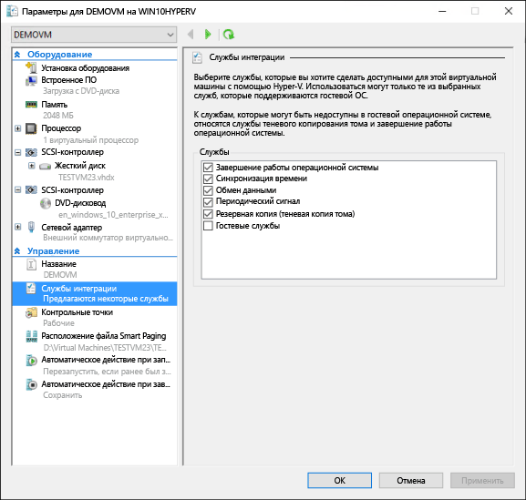
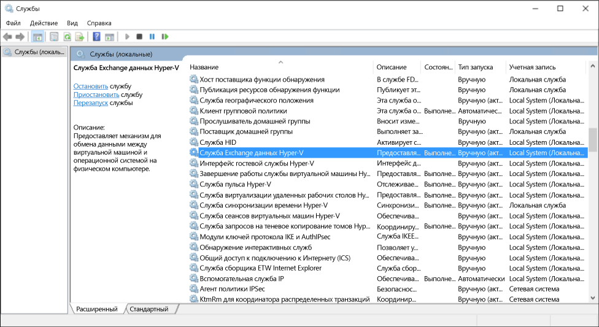

# Управление службами интеграции Hyper-V

Службы интеграции (часто называемые компонентами интеграции) — это службы, позволяющие виртуальной машине связываться с узлом Hyper-V. Многие из этих служб используются для удобства (например, копирования файлов гостевой ОС), а другие могут быть достаточно важны для правильной работы гостевой ОС (синхронизация времени).

В этой статье подробно рассматривается управление службами интеграции с помощью диспетчера Hyper-V и оболочки PowerShell в Windows 10. Дополнительные сведения о каждой отдельной службе интеграции см. в статье [Службы интеграции](https://technet.microsoft.com/en-us/library/dn798297.aspx).

## Включение и отключение служб интеграции с помощью диспетчера Hyper-V

1. Выберите виртуальную машину и откройте параметры.
    

2. В окне параметров виртуальной машины перейдите на вкладку "Службы интеграции" в разделе "Управление".

    

    Здесь указаны все службы интеграции, доступные на этом узле Hyper-V. Обратите внимание, что гостевая операционная система может поддерживать не все указанные службы интеграции.

## Включение и отключение служб интеграции с помощью PowerShell

Службы интеграции также можно включать и отключать с помощью командлетов [`Enable-VMIntegrationService`](https://technet.microsoft.com/en-us/library/hh848500.aspx) и [`Disable-VMIntegrationService`](https://technet.microsoft.com/en-us/library/hh848488.aspx) в PowerShell.

В следующем примере мы включим, а затем отключим службу копирования файлов гостевой ОС на виртуальной машине demovm, показанной выше.

1. Узнайте, какие службы интеграции запущены.

  ``` PowerShell
  Get-VMIntegrationService -VMName "demovm"
  ```

  Результат будет выглядеть так:
  ``` PowerShell
  VMName      Name                    Enabled PrimaryStatusDescription SecondaryStatusDescription
  ------      ----                    ------- ------------------------ --------------------------
  demovm      Guest Service Interface False   OK
  demovm      Heartbeat               True    OK                       OK
  demovm      Key-Value Pair Exchange True    OK
  demovm      Shutdown                True    OK
  demovm      Time Synchronization    True    OK
  demovm      VSS                     True    OK
  ```

2. Включите службу интеграции `Guest Service Interface` (Интерфейс гостевой службы).

   ``` PowerShell
   Enable-VMIntegrationService -VMName "demovm" -Name "Guest Service Interface"
   ```

   Служба интеграции "Интерфейс гостевой службы" включается с помощью команды `Get-VMIntegrationService -VMName "demovm"`.

3. Отключите службу интеграции `Guest Service Interface`.

   ``` PowerShell
   Disable-VMIntegrationService -VMName "demovm" -Name "Guest Service Interface"
   ```

Службы интеграции работают, только если они включены и на узле, и в гостевой операционной системе. Все службы интеграции в гостевых ОС Windows включены по умолчанию, но их можно отключить. Инструкции приведены в следующем разделе.


## Управление службами интеграции из гостевой ОС (Windows)

> **Примечание.** Отключение служб интеграции может серьезно повлиять на возможность узлов управлять вашей виртуальной машиной. Службы интеграции работают, только если они включены и на узле, и в гостевой операционной системе.

Службы интеграции отображаются как службы Windows. Чтобы включить или отключить службы интеграции из виртуальной машины, откройте диспетчер служб Windows.



Найдите службы, в имени которых есть слово Hyper-V. Щелкните правой кнопкой мыши службу, которую требуется включить или отключить, а затем запустите или остановите ее.

Чтобы просмотреть все службы интеграции с помощью PowerShell, выполните следующую команду:

```PowerShell
Get-Service -Name vm*
```

Отобразится примерно такой список:

```PowerShell
Status   Name               DisplayName
------   ----               -----------
Running  vmicguestinterface Hyper-V Guest Service Interface
Running  vmicheartbeat      Hyper-V Heartbeat Service
Running  vmickvpexchange    Hyper-V Data Exchange Service
Running  vmicrdv            Hyper-V Remote Desktop Virtualizati...
Running  vmicshutdown       Hyper-V Guest Shutdown Service
Running  vmictimesync       Hyper-V Time Synchronization Service
Stopped  vmicvmsession      Hyper-V VM Session Service
Running  vmicvss            Hyper-V Volume Shadow Copy Requestor
```

Запустите или остановите службы с помощью командлетов [`Start-Service`](https://technet.microsoft.com/en-us/library/hh849825.aspx) и [`Stop-Service`](https://technet.microsoft.com/en-us/library/hh849790.aspx).

По умолчанию в гостевой операционной системе все службы интеграции включены.

## Управление службами интеграции из гостевой ОС (Linux)

Службы интеграции Linux обычно предоставляются через ядро Linux.

Убедитесь, что драйвер и управляющие программы служб интеграции запущены, выполнив указанные ниже команды в гостевой операционной системе Linux.

1. Драйвер служб интеграции Linux называется hv_utils. Чтобы узнать, загружен ли он, выполните следующую команду:

  ``` BASH
  lsmod | grep hv_utils
  ```

  Результат должен выглядеть примерно так:

  ``` BASH
  Module                  Size   Used by
  hv_utils               20480   0
  hv_vmbus               61440   8 hv_balloon,hyperv_keyboard,hv_netvsc,hid_hyperv,hv_utils,hyperv_fb,hv_storvsc
  ```

2. Чтобы проверить, запускаются ли необходимые управляющие программы, в гостевой операционной системе Linux выполните следующую команду:

  ``` BASH
  ps -ef | grep hv
  ```

  Результат должен выглядеть примерно так:

  ``` BASH
  root       236     2  0 Jul11 ?        00:00:00 [hv_vmbus_con]
  root       237     2  0 Jul11 ?        00:00:00 [hv_vmbus_ctl]
  ...
  root       252     2  0 Jul11 ?        00:00:00 [hv_vmbus_ctl]
  root      1286     1  0 Jul11 ?        00:01:11 /usr/lib/linux-tools/3.13.0-32-generic/hv_kvp_daemon
  root      9333     1  0 Oct12 ?        00:00:00 /usr/lib/linux-tools/3.13.0-32-generic/hv_kvp_daemon
  root      9365     1  0 Oct12 ?        00:00:00 /usr/lib/linux-tools/3.13.0-32-generic/hv_vss_daemon
  scooley  43774 43755  0 21:20 pts/0    00:00:00 grep --color=auto hv          
  ```

  Чтобы отобразить все доступные управляющие программы, выполните следующую команду:
  ``` BASH
  compgen -c hv_
  ```

  Результат должен выглядеть примерно так:

  ``` BASH
  hv_vss_daemon
  hv_get_dhcp_info
  hv_get_dns_info
  hv_set_ifconfig
  hv_kvp_daemon
  hv_fcopy_daemon     
  ```

  Вы можете увидеть такие управляющие команды:
* **`hv_vss_daemon`**— необходима для создания динамических резервных копий виртуальной машины Linux.
* **`hv_kvp_daemon`** — позволяет задавать и запрашивать внутренние и внешние пары "ключ-значение".
* **`hv_fcopy_daemon`** — реализует службу копирования файлов между узлом и гостевой операционной системой.

> **Примечание.** Если указанные выше управляющие программы служб интеграции недоступны, возможно, они не поддерживаются вашей операционной системой или не установлены. Дополнительные сведения о дистрибутивах Linux можно найти [здесь](https://technet.microsoft.com/en-us/library/dn531030.aspx).

В следующем примере мы остановим и запустим управляющую программу KVP — `hv_kvp_daemon`.

Остановите процесс управляющей программы с помощью идентификатора процесса, указанного во втором столбце приведенных выше результатов. Кроме того, нужный процесс можно найти с помощью программы `pidof`. Так как управляющие программы Hyper-V запускаются как корень, необходимы разрешения корневой папки.

``` BASH
sudo kill -15 `pidof hv_kvp_daemon`
```

Теперь, если выполнить команду `ps -ef | hv` снова, вы обнаружите, что процесс `hv_kvp_daemon` исчез.

Чтобы запустить управляющую программу снова, запустите ее как корень.

``` BASH
sudo hv_kvp_daemon
```

Теперь, если выполнить команду `ps -ef | hv` снова, вы обнаружите процесс `hv_kvp_daemon` с новым идентификатором.


## Обновление служб интеграции

Для максимальной производительности и функциональности виртуальной машины требуется регулярное обновление служб интеграции.

**Для виртуальных машин, работающих на узлах под управлением Windows 10:**

| Гостевая ОС| Механизм обновления| Заметки|
|:---------|:---------|:---------|
| Windows 10| Центр обновления Windows| |
| Windows 8.1| Центр обновления Windows| |
| Windows 8| Центр обновления Windows| Требуется служба интеграции обмена данными*****.|
| Windows 7| Центр обновления Windows| Требуется служба интеграции обмена данными*****.|
| Windows Vista с пакетом обновления 2 (SP2)| Центр обновления Windows| Требуется служба интеграции обмена данными*****.|
| —| | |
| Windows Server 2012 R2| Центр обновления Windows| |
| Windows Server 2012| Центр обновления Windows| Требуется служба интеграции обмена данными*****.|
| Windows Server 2008 R2| Центр обновления Windows| Требуется служба интеграции обмена данными*****.|
| Windows Server 2008 с пакетом обновления 2 (SP 2)| Центр обновления Windows| Требуется служба интеграции обмена данными*****.|
| Windows Home Server 2011| Центр обновления Windows| Требуется служба интеграции обмена данными*****.|
| Windows Small Business Server 2011| Центр обновления Windows| Требуется служба интеграции обмена данными*****.|


**\*** Если служба интеграции обмена данными не включается, компоненты интеграции для этих гостевых систем можно найти [здесь](https://support.microsoft.com/en-us/kb/3071740) в формате CAB-файла в центре загрузки. Инструкции по применению CAB-файлов можно найти [здесь](http://blogs.technet.com/b/virtualization/archive/2015/07/24/integration-components-available-for-virtual-machines-not-connected-to-windows-update.aspx).


**Для виртуальных машин, работающих на узлах под управлением Windows 8.1:**

| Гостевая ОС| Механизм обновления| Заметки|
|:---------|:---------|:---------|
| Windows 10| Центр обновления Windows| |
| Windows 8.1| Центр обновления Windows| |
| Windows 8| Диск со службами интеграции| |
| Windows 7| Диск со службами интеграции| |
| Windows Vista с пакетом обновления 2 (SP2)| Диск со службами интеграции| |
| Windows XP с пакетами обновления 2 и 3 (SP2, SP3)| Диск со службами интеграции| |
| —| | |
| Windows Server 2012 R2| Центр обновления Windows| |
| Windows Server 2012| Диск со службами интеграции| |
| Windows Server 2008 R2| Диск со службами интеграции| |
| Windows Server 2008 с пакетом обновления 2 (SP2)| Диск со службами интеграции| |
| Windows Home Server 2011| Диск со службами интеграции| |
| Windows Small Business Server 2011| Диск со службами интеграции| |
| Windows Server 2003 R2 с пакетом обновления 2 (SP2)| Диск со службами интеграции| |
| Windows Server 2003 с пакетом обновления 2 (SP2)| Диск со службами интеграции| |

**Для виртуальных машин, работающих на узлах под управлением Windows 8:**

| Гостевая ОС| Механизм обновления| Заметки|
|:---------|:---------|:---------|
| Windows 8.1| Центр обновления Windows| |
| Windows 8| Диск со службами интеграции| |
| Windows 7| Диск со службами интеграции| |
| Windows Vista с пакетом обновления 2 (SP2)| Диск со службами интеграции| |
| Windows XP с пакетами обновления 2 и 3 (SP2, SP3)| Диск со службами интеграции| |
| —| | |
| Windows Server 2012 R2| Центр обновления Windows| |
| Windows Server 2012| Диск со службами интеграции| |
| Windows Server 2008 R2| Диск со службами интеграции| |
| Windows Server 2008 с пакетом обновления 2 (SP2)| Диск со службами интеграции| |
| Windows Home Server 2011| Диск со службами интеграции| |
| Windows Small Business Server 2011| Диск со службами интеграции| |
| Windows Server 2003 R2 с пакетом обновления 2 (SP2)| Диск со службами интеграции| |
| Windows Server 2003 с пакетом обновления 2 (SP2)| Диск со службами интеграции| |

Инструкции по обновлению с помощью диска со службами интеграции для Windows 8 и Windows 8.1 можно найти [здесь](https://technet.microsoft.com/en-us/library/hh846766.aspx#BKMK_step4).

**\*\*** Дополнительные сведения о гостевых ОС Linux см. [здесь](https://technet.microsoft.com/en-us/library/dn531030.aspx).


