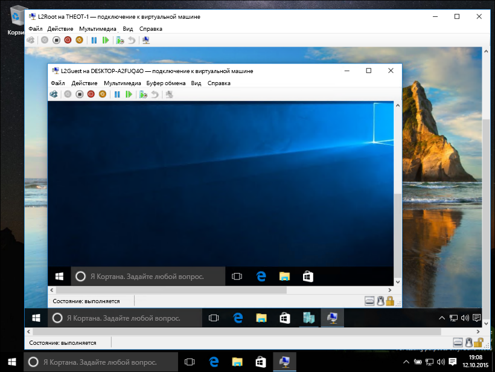
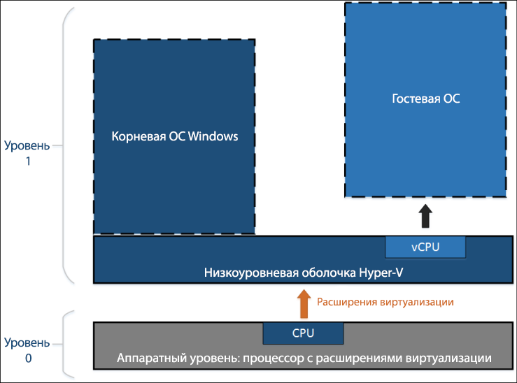
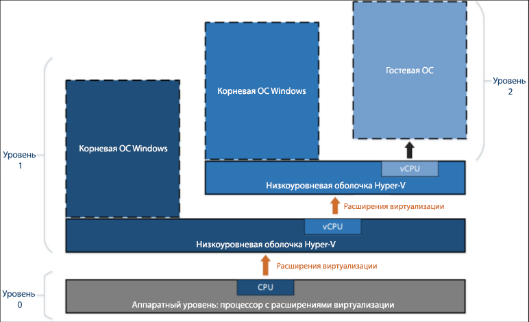

# Вложенная виртуализация

> **Примечание.** Эта предварительная версия функции доступна только участникам программы предварительной оценки Windows, использующим сборку 10565 или более позднюю, и предоставляется без гарантий производительности и стабильности.

Вложенная виртуализация — это виртуализация в виртуализированной среде. Другими словами, вложение позволяет запускать роль сервера Hyper-V в самой виртуальной машине.



Запуск виртуальных машин Hyper-V зависит от поддержки аппаратной виртуализации (например, Intel VT-x и AMD-V). Как правило, после установки Hyper-V низкоуровневая оболочка скрывает эту возможность от гостевых виртуальных машин. Поэтому они не могут запустить роль сервера Hyper-V вместе с другими низкоуровневыми оболочками.

Вложенная виртуализация предоставляет эти компоненты аппаратной виртуализации гостевой виртуальной машине.

На схеме ниже показана роль Hyper-V без вложения. Низкоуровневая оболочка Hyper-V полностью контролирует расширения аппаратной виртуализации (оранжевая стрелка) и скрывает их от операционной системы.



На следующей схеме показана роль Hyper-V с вложением. В этом случае Hyper-V предоставляет расширения аппаратной виртуализации виртуальным машинам. Если вложение включено, гостевая виртуальная машина может установить собственную низкоуровневую оболочку и запускать свои гостевые виртуальные машины.



## Требования к системе для использования вложенной виртуализации

Перед включением вложенной виртуализации обратите внимание, что это предварительная версия. Не используйте вложение в рабочих средах.

Требования:
* Минимум 4 ГБ ОЗУ. Для вложенной виртуализации требуется достаточно большой объем оперативной памяти.
* Обе низкоуровневые оболочки должны работать под управлением Windows 10 Insider Preview последней сборки (10565 или более поздней). Другие низкоуровневые оболочки не подходят.
* В настоящее время эта функция поддерживается только на компьютерах с процессорами Intel. Требуется технология Intel VT-x.

## Включение вложенной виртуализации

1. Создайте виртуальную машину под управлением ОС той же сборки, что и на вашем узле. Инструкции см. [здесь](../quick_start/walkthrough_create_vm.md).

2. Запустите [этот сценарий](https://github.com/Microsoft/Virtualization-Documentation/blob/master/hyperv-tools/Nested/Enable-NestedVm.ps1) от имени администратора на узле Hyper-V.

    В этой предварительной версии установлены определенные требования к конфигурации. Чтобы упростить работу, запустите [этот сценарий PowerShell](https://github.com/Microsoft/Virtualization-Documentation/blob/master/hyperv-tools/Nested/Enable-NestedVm.ps1), который проверит конфигурацию, внесет необходимые изменения и включит вложенную виртуализацию для указанной виртуальной машины.

  ``` PowerShell
  Invoke-WebRequest https://raw.githubusercontent.com/Microsoft/Virtualization-Documentation/master/hyperv-tools/Nested/Enable-NestedVm.ps1 -OutFile ~/Enable-NestedVm.ps1 
  ~/Enable-NestedVm.ps1 -VmName "DemoVM"
  ```

3. Установите Hyper-V на виртуальной машине.

  ``` PowerShell
  Invoke-Command -VMName "DemoVM" -ScriptBlock { Enable-WindowsOptionalFeature -FeatureName Microsoft-Hyper-V -Online; Restart-Computer }
  ```

4. Создайте вложенные виртуальные машины.

## Известные проблемы

Ниже приводится список известных проблем:
* Узлы, на которых включена функция Device Guard, не могут предоставить расширения виртуализации гостевым виртуальным машинам.

* Узлы, на которых включено средство обеспечения безопасности на основе виртуализации, не могут предоставить расширения виртуализации гостевым виртуальным машинам. Для работы предварительной версии вложенной виртуализации необходимо отключить средство обеспечения безопасности на основе виртуализации.

* После включения вложенной виртуализации на виртуальной машине указанные ниже функции становятся с ней несовместимы.  
    Эти действия завершатся ошибкой или приведут к тому, что виртуальная машина не запустится, если на ней размещены другие виртуальные машины:
    * Необходимо отключить динамическую память, иначе виртуальная машина не запустится.
    * Изменение размера рабочей памяти.
    * Применение контрольных точек к работающей виртуальной машине.
    * Динамическая миграция виртуальной машины, на которой размещены другие виртуальные машины.
    * Сохранение или восстановление.

    > **Примечание.** Эти функции будут по-прежнему работать во "внутренних" гостевых виртуальных машинах. Ограничения относятся только к виртуальным машинам первого уровня.

* Чтобы во "внутренних" гостевых виртуальных машинах работала сеть, после включения вложенной виртуализации на виртуальной машине необходимо включить спуфинг MAC-адресов.

## Часто задаваемые вопросы и устранение неполадок

### Что делать, если виртуальная машина не запускается?

1. Убедитесь, что динамическая память отключена.
2. Запустите приведенные ниже сценарий PowerShell на хост-компьютере из командной строки с повышенными привилегиями.

    Этот сценарий проверяет, правильно ли настроен узел и виртуальные машины для вложенной виртуализации.

  ``` PowerShell
  Invoke-WebRequest https://raw.githubusercontent.com/Microsoft/Virtualization-Documentation/master/hyperv-tools/Nested/Get-NestedVirtStatus.ps1 -OutFile ~/Get-NestedVirtStatus.ps1 
  ~/Get-NestedVirtStatus.ps1
  ```

### Пропадает подключение к виртуальной машине.

Если вы используете пустой пароль, это известная проблема. Измените пароль, и проблема будет решена.

### Моя проблема здесь не указана.

В списке нет вашей проблемы? Хотите поделиться мнением? Свяжитесь с нами.

Используйте приложение "Отзывы о Windows", [форумы по виртуализации](https://social.technet.microsoft.com/Forums/windowsserver/En-us/home?forum=winserverhyperv) или веб-сервис [GitHub](https://github.com/Microsoft/Virtualization-Documentation).


