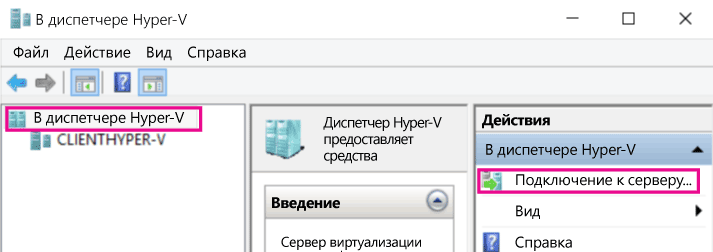
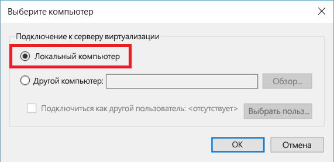
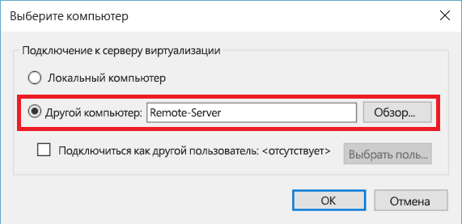
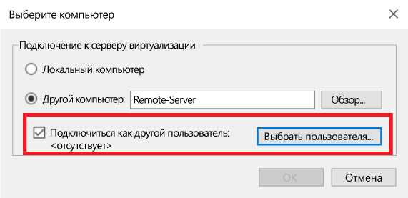

# Управление удаленными узлами Hyper-V с помощью диспетчера Hyper-V

Диспетчер Hyper-V — это встроенное средство для управления локальным узлом Hyper-V, а также небольшим количеством удаленных узлов, а также их диагностики.  В этой статье приведены инструкции по подключению к узлам Hyper-V с помощью диспетчера Hyper-V во всех поддерживаемых конфигурациях.

> Диспетчер Hyper-V доступен в разделе **Программы и компоненты** под названием **Средства управления Hyper-V** в [любой ОС Windows с Hyper-V](../quick_start/walkthrough_compatibility.md#operating-system-requirements).  Включать платформу Hyper-V для управления удаленными компьютерами необязательно.

Чтобы подключиться к узлу Hyper-V в диспетчере Hyper-V, убедитесь, что на панели слева выбран **Диспетчер Hyper-V**, и выберите пункт **Подключение к серверу...** на панели справа.



## Сочетания узлов Hyper-V, поддерживаемые диспетчером Hyper-V
Диспетчер Hyper-V в Windows 10 позволяет управлять следующими узлами Hyper-V:
* Windows 10
* Windows 8.1
* Windows 8
* Windows Server 2016 — всеми выпусками и вариантами установки, включая Nano Server, и соответствующую версию Hyper-V Server.
* Windows Server 2012 R2 — всеми выпусками и вариантами установки, а также соответствующей версией Hyper-V Server.
* Windows Server 2012 — всеми выпусками и вариантами установки, а также соответствующей версией Hyper-V Server.

Диспетчер Hyper-V в Windows 8.1 и Windows Server 2012 R2 позволяет управлять следующим:
* Windows 8.1
* Windows 8
* Windows Server 2012 R2 — всеми выпусками и вариантами установки, а также соответствующей версией Hyper-V Server.
* Windows Server 2012 — всеми выпусками и вариантами установки, а также соответствующей версией Hyper-V Server.

Диспетчер Hyper-V в Windows 8 и Windows Server 2012 позволяет управлять следующим:
* Windows 8
* Windows Server 2012 — всеми выпусками и вариантами установки, а также соответствующей версией Hyper-V Server.

Диспетчер Hyper-V в Windows 7 и Windows Server 2008 R2 позволяет управлять следующим:
* Windows Server 2008 R2 — всеми выпусками и вариантами установки, а также соответствующей версией Hyper-V Server.

Диспетчер Hyper-V в Windows Vista и Windows Server 2008 позволяет управлять следующим:
* Windows Server 2008 — всеми выпусками и вариантами установки, а также соответствующей версией Hyper-V Server.

> **Примечание.** Функциональность диспетчера Hyper-V соответствует функциональности управляемой версии. Другими словами, если вы управляете удаленным узлом Windows Server 2012 из Windows Server 2012 R2, то новые возможности диспетчера Hyper-V из Windows Server 2012 R2 будут недоступны.

## Управление локальным узлом ##
Чтобы добавить локальный узел в диспетчер Hyper-V в качестве узла Hyper-V, выберите пункт **Локальный компьютер** в диалоговом окне **Выбор компьютера**.



Если не удается установить подключение:
*  Убедитесь, что включена роль платформы Hyper-V.  
  Сведения о поддержке Hyper-V см. в [этом разделе пошагового руководства о проверке совместимости](../quick_start/walkthrough_compatibility.md).
*  Убедитесь, что ваша учетная запись пользователя принадлежит к группе администраторов Hyper-V.


## Управление другим узлом Hyper-V в одном домене ##

Чтобы добавить удаленный узел Hyper-V в диспетчер Hyper-V, выберите пункт **Другой компьютер** в диалоговом окне **Выбор компьютера** и в текстовом поле введите имя узла, NetBIOS-имя или полное доменное имя удаленного узла.



Чтобы управлять удаленными узлами Hyper-V, необходимо включить удаленное управление на локальном компьютере и удаленном узле.

Для этого выберите пункты `Server Manager -> Remote management` или выполните от имени администратора следующую команду PowerShell: 

``` PowerShell
Enable-PSRemoting
```

Если ваша текущая учетная запись пользователя соответствует учетной записи администратора Hyper-V на удаленном узле, нажмите кнопку **ОК**, чтобы подключиться.  

> Это единственный способ управления удаленным узлом в диспетчере Hyper-V в Windows 8 или Windows 8.1.


В Windows 10 возможные сочетания типов удаленного подключения значительно расширены.  
Теперь подключиться к удаленному узлу Windows 10 или более поздней версии можно с помощью имени или IP-адреса узла.  Теперь диспетчер Hyper-V поддерживает альтернативные учетные данные пользователя.  


### Подключение к удаленному узлу от имени другого пользователя
> Эта возможность доступна только при подключении к удаленному узлу Windows 10 или Windows Server 2016 Technical Preview 3 или более поздней версии.

В Windows 10, если ваша учетная запись пользователя не позволяет управлять удаленным узлом, вы можете подключиться от имени другого пользователя с альтернативными учетными данными.

Чтобы указать учетные данные для удаленного узла Hyper-V, установите флажок **Подключиться от имени другого пользователя: ** в диалоговом окне **Выбор компьютера**, а затем нажмите кнопку **Выбрать пользователя...**.




### Подключение к удаленному узлу с помощью IP-адреса
> Эта возможность доступна только при подключении к удаленному узлу Windows 10 или Windows Server 2016 Technical Preview 3 или более поздней версии.

Иногда проще подключиться, используя IP-адрес, а не имя узла. В Windows 10 это возможно.

Чтобы подключиться с помощью IP-адреса, введите IP-адрес в текстовое поле **Другой компьютер**.


## Управление узлом Hyper-V за пределами домена (или без домена) ##
> Эта возможность доступна только при подключении к удаленному узлу Windows 10 или Windows Server 2016 Technical Preview 3 или более поздней версии.

На управляемом узле Hyper-V выполните следующие команды от имени администратора:

1.  [Enable-PSRemoting](https://technet.microsoft.com/en-us/library/hh849694.aspx)
  * Команда [Enable-PSRemoting](https://technet.microsoft.com/en-us/library/hh849694.aspx) создает необходимые правила брандмауэра для *частных* зон сети. Чтобы разрешить такой доступ для общедоступных зон, нужно включить правила для CredSSP и WinRM.
2.  [Enable-WSManCredSSP](https://technet.microsoft.com/en-us/library/hh849872.aspx) -Role server

На управляющем компьютере запустите следующую команду от имени администратора:

1. Set-Item WSMan:\localhost\Client\TrustedHosts -Value "fqdn узла hyper-v"
2. [Enable-WSManCredSSP](https://technet.microsoft.com/en-us/library/hh849872.aspx) -Role client -DelegateComputer "полное_доменное_имя_узла_hyper-v"
3. Кроме того, вам может потребоваться настроить следующую групповую политику: ** Конфигурация компьютера | Административные шаблоны | Система | Передача учетных данных | Разрешить передачу новых учетных данных с проверкой подлинности сервера «только NTLM»**.
    * Щелкните **Включить** и добавьте *wsman/полное_доменное_имя_узла_hyper-v*


<!--HONumber=Nov16_HO1-->


