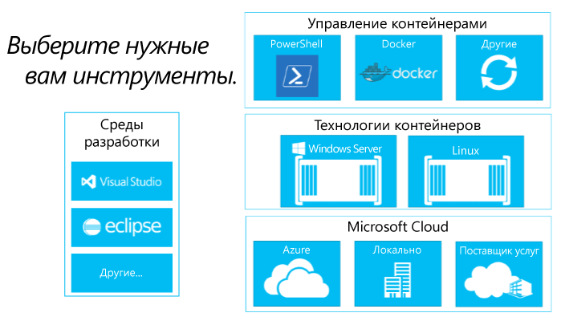

# Создание экосистем контейнеров

Чтобы понять, зачем очень важнее создание экосистемы контейнеров, давайте сначала поговорим о ее компонентах.

## Компоненты экосистемы контейнеров

Контейнеры Windows — это ключевой компонент большой экосистемы контейнеров. Мы работаем во всех направлениях, чтобы поддержать выбор разработчиков на каждом уровне стека решений.

Контейнерная экосистема предоставляет способы управления, совместного использования и разработки приложений, выполняемых в контейнерах.

Корпорация Майкрософт хочет поддержать выбор разработчиков, которые создают эти приложения следующего поколения. Наша цель состоит в том, чтобы пополнить производительность разработчиками, а это значит, что вы можете использовать приложения для любого облака Майкрософт, не требуя вносить изменения, переписывать или перенастраивать код.

Корпорация Майкрософт считает, что она удобна в открытии и в экосистеме. Мы активно поддерживаем сочетание некоторых интересов для разработчиков, таких как Windows и Linux, и для решения инноваций.

В течение ближайших месяцев мы добавим дополнительные сведения о дополнительных партнерах в этой разработке экосистемы.