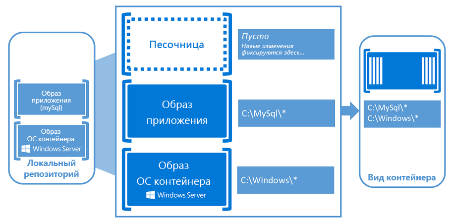

# О контейнерах Windows

Представьте себе кухню. В этой одной комнате есть все, что нужно, чтобы пропустить еду: печь, панорамирование, раковина и т. д. Это наш контейнер.

Теперь представьте себе этот кухни в здании так же просто, как и перевод книги на полку. Так как все, что нужно для работы в кухни, уже есть, нам нужно присоединиться к кулинарной электроэнергии и водопровода.

Зачем остановиться? Вы можете настроить создание в любом удобном виде. заполните ее большим количеством видов комнат, заполните их идентичными комнатами или создайте смесь двух.

Контейнеры играют роль в этом помещении, запустив приложение так, как мы будем рады с нашей кухни. Контейнер помещает приложение и все, что приложение должно работать в собственной изолированной рамке. В результате изолированное приложение не знает о каких-либо других приложениях или процессах, которые находятся за пределами контейнера. Поскольку в контейнере есть все, что нужно для работы приложения, контейнер можно переместить в любое место, используя только ресурсы его хост-приложения, не касаясь ресурсов, предоставленных для других контейнеров.

В приведенном ниже видеоролике вы узнаете о том, какие контейнеры Windows могут делать ваши возможности, а также о том, как партнерство Майкрософт с стыковочным узлом помогает создавать среду без трения для разработки контейнера с открытым исходным кодом.

<iframe width="800" height="450" src="https://www.youtube.com/embed/Ryx3o0rD5lY" frameborder="0" allow="accelerometer; autoplay; encrypted-media; gyroscope; picture-in-picture" allowfullscreen></iframe>

## Основы контейнеров

Чтобы узнать, как начать работать с контейнерами Windows, ознакомьтесь с определенными терминами.

- Узел контейнера: физическая или виртуальная система компьютера, настроенная с помощью функции контейнера Windows. Узел контейнера будет запускать один или несколько контейнеров Windows.
- Песочница: слой, который фиксирует все изменения, внесенные во время работы над контейнером (например, изменения файловой системы, изменения в реестре или установка программного обеспечения).
- Основной образ: первый слой в слоях изображения контейнера, который обеспечивает среду операционной системы контейнера. Базовое изображение изменить нельзя.
- Изображение контейнера: доступный только для чтения шаблон инструкций по созданию контейнера. Изображения могут основываться на базовой, неизмененной среде операционной системы, но также могут создаваться из изолированной среды измененного контейнера. Эти измененные изображения разслойируют изменения на базовом уровне изображения, и эти слои можно скопировать и повторно применить к другим основным изображениям, чтобы создать новое изображение с теми же изменениями.
- Репозиторий контейнеров: локальный репозиторий, в котором хранится изображение контейнера и его зависимости каждый раз, когда вы создаете новое изображение. Вы можете повторно использовать сохраненные изображения столько, сколько угодно на узле контейнера. Кроме того, вы можете хранить изображения контейнера в общедоступном или частном реестре, таком как стыковочный узел, чтобы их можно было использовать на множестве разных хост-контейнеров.
- Контейнерная Orchestrator — это процесс, автоматизирующий и управляющий большим количеством контейнеров и способ их взаимодействия друг с другом. Дополнительные сведения можно найти в разделе [о orchestrations Containers для Windows](overview-container-orchestrators.md).
- Dock — автоматический процесс, который упаковывает и доставляет изображения контейнера. Дополнительные сведения можно найти в разделе [Общие сведения о стыковочных](docker-overview.md)модулях, а также о подстыковочного устройства [в Windows](../manage-docker/configure-docker-daemon.md) или посетите [веб-сайт Dock](https://www.docker.com).

Кто-то знаком с виртуальными машинами может показаться, что контейнеры и виртуальные машины кажутся похожими. Контейнер выполняет операционную систему, имеет файловую систему и доступ к ней можно получить, как в сети, так же как физическая или виртуальная компьютерная система. При этом у контейнеров и виртуальных машин совершенно разные технология и принцип работы. Чтобы узнать больше об этих концепциях, прочитайте раздел запись [блога](https://azure.microsoft.com/blog/containers-docker-windows-and-trends/) Руссинович, посвященный более подробной разнице.

### Типы контейнеров Windows

Кроме того, следует знать, что существует два разных типа контейнеров, называемых также средами выполнения.

Контейнеры Windows Server обеспечивают изоляцию приложений с помощью технологии и процесса изоляции пространства имен, поэтому эти контейнеры также называются контейнерами с изолированными процессами. Контейнер Windows Server использует ядро совместно с узлом контейнера и всеми остальными контейнерами на этом узле. Эти контейнеры изолированных процессов не предоставляют доступную границу безопасности и не должны использоваться для изоляции ненадежного кода. Из-за общего пространства ядра для этих контейнеров требуется одинаковая версия и конфигурация ядра.

Изоляция Hyper-V расширяется на уровне изоляции, предоставляемых контейнерами Windows Server, запустив каждый контейнер на высокооптимизированной виртуальной машине. В этой конфигурации узел контейнера не предоставляет доступ к ядру другим контейнерам на том же узле. Эти контейнеры предназначены для неблагоприятных сред с несколькими арендаторами и обеспечивают уровень безопасности, аналогичный уровню защиты, обеспечиваемой виртуальной машиной. Поскольку эти контейнеры не используют ядро вместе с ведущим узлом или другими контейнерами на узле, они могут запускать ядра с различными версиями и конфигурациями (в поддерживаемых версиях). Например, все контейнеры Windows в Windows 10 используют изоляцию Hyper-V для использования версии ядра Windows Server и конфигурации.

Выполнение контейнера в Windows с изоляцией Hyper-V и без него — это решение во время выполнения. Вы можете сначала создать контейнер с изоляцией Hyper-V, а затем позднее во время выполнения, чтобы запустить его как контейнер Windows Server.

## Пользователи контейнера

### Контейнеры для разработчиков

Контейнеры помогают разработчикам создавать и отставлять более качественные приложения быстрее. Разработчики могут создавать закрепляемые изображения, которые будут развертываться одинаково во всех средах в секундах. Существует обширное и растущее множество приложений, упакованных в контейнеры DOCKER. Доккерхуб, общедоступный контейнер — реестр приложения, поддерживаемый стыковочным узлом, опубликовал более 180 000 приложений в общедоступном репозитории сообщества, и этот номер по-прежнему растет.

Когда разработчик контаинеризес приложение, в него объединяются только приложение и компоненты, необходимые для его запуска. При необходимости на базе этого образа создаются контейнеры. Кроме того, образ можно создать на основе другого образа, что еще более ускоряет рабочий процесс. Несколько контейнеров могут совместно использовать одно и то же изображение, что означает, что контейнеры запускаются очень быстро и используют меньше ресурсов. Например, разработчик может использовать контейнеры для прокрутки облегченных и переносимых компонентов приложения, также называемых микрослужбами, для распределенных приложений и быстрого масштабирования каждой службы по отдельности.

Контейнеры — это переносимые и гибкие возможности, которые могут быть написаны на любом языке, и они совместимы с любым компьютером под управлением Windows Server 2016. Разработчики могут создавать и тестировать контейнеры локально на своем ноутбуке или настольном компьютере, а затем развертывать тот же контейнер в частном облаке компании, в общедоступном облаке или в поставщике услуг. Естественная гибкость контейнеров поддерживает современные шаблоны разработки приложений в крупномасштабных виртуализованных облачных средах.

### Контейнеры для ИТ-специалистов

Контейнеры помогают администраторам создавать инфраструктуру, которую проще обновлять и обслуживать. ИТ-специалисты могут использовать контейнеры для предоставления стандартизированных сред для разработки, контроля качества и производственных групп. Больше не нужно беспокоиться о сложных процедурах установки и настройки. Используя контейнеры, системные администраторы могут выбросить различия в установке ОС и базовой инфраструктуре.

## Контейнеры для видеопрезентации 101

В приведенной ниже видеопрезентации вы узнаете более подробное описание истории и реализации контейнеров Windows.

<iframe src="https://channel9.msdn.com/Blogs/containers/Containers-101-with-Microsoft-and-Docker/player" width="800" height="450" allowFullScreen="true" frameBorder="0" scrolling="no"></iframe>

## Использование контейнеров Windows Server

Чтобы приступить к работе с контейнерами на Windows Server или Windows 10, ознакомьтесь со [статьей начало работы: Настройка среды для контейнеров](../quick-start/set-up-environment.md).
