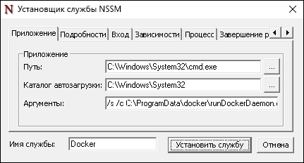
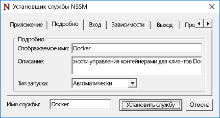
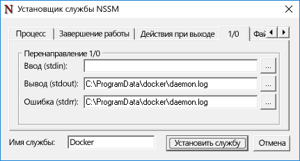

# Docker и Windows

**Это предварительное содержимое. Возможны изменения.**

Docker — платформа для развертывания контейнеров Linux и Windows, а также управления ими. С помощью Docker можно создавать и удалять контейнеры и образы контейнеров, а также управлять ими. Docker позволяет хранить образы контейнеров в общедоступном (Docker Hub) и частных реестрах (Docker Trusted Registries). Кроме того, Docker обеспечивает кластеризацию узлов контейнера с помощью Docker Swarm и автоматизацию развертывания с помощью Docker Compose. Дополнительные сведения о Docker и наборе инструментов Docker см. на сайте [Docker.com](https://www.docker.com/).

> Прежде чем использовать Docker для создания контейнеров Windows Server и Hyper-V, необходимо включить функцию контейнера Windows. Соответствующие инструкции см. в разделе [Руководство по развертыванию узлов контейнера](./docker_windows.md).

## Windows Server

### Установка Docker

Управляющая программа и интерфейс командной строки Docker не входят в комплект поставки Windows Server или Windows Server Core и не устанавливаются вместе с функцией контейнера Windows. Docker необходимо устанавливать отдельно. В этом документе описан процесс установки управляющей программы и клиента Docker вручную. Кроме того, приводятся способы автоматического выполнения этих задач.

Управляющая программа и интерфейс командной строки Docker написаны на языке Go. В настоящее время файл docker.exe не устанавливается как служба Windows. Создать службу Windows можно несколькими способами. В приведенном ниже примере используется программа `nssm.exe`.

Загрузите файл docker.exe на странице `https://aka.ms/tp4/docker` и поместите его в каталог System32 на узле контейнера.

```powershell
PS C:\> wget https://aka.ms/tp4/docker -OutFile $env:SystemRoot\system32\docker.exe
```

Создайте каталог с именем `c:\programdata\docker`. В нем создайте файл с именем `runDockerDaemon.cmd`.

```powershell
PS C:\> New-Item -ItemType File -Path C:\ProgramData\Docker\runDockerDaemon.cmd -Force
```

Скопируйте следующий текст в файл `runDockerDaemon.cmd`. Этот пакетный файл запускает управляющую программу Docker с помощью команды `docker daemon –D –b "Virtual Switch"`. Примечание. Имя виртуального коммутатора в этом файле должно совпадать с именем виртуального коммутатора, который контейнеры будут использовать для подключения к сети.

```powershell
@echo off
set certs=%ProgramData%\docker\certs.d

if exist %ProgramData%\docker (goto :run)
mkdir %ProgramData%\docker

:run
if exist %certs%\server-cert.pem (goto :secure)

docker daemon -D -b "Virtual Switch"
goto :eof

:secure
docker daemon -D -b "Virtual Switch" -H 0.0.0.0:2376 --tlsverify --tlscacert=%certs%\ca.pem --tlscert=%certs%\server-cert.pem --tlskey=%certs%\server-key.pem
```
Загрузите программу nssm.exe, архив которой расположен по адресу [https://nssm.cc/release/nssm-2.24.zip](https://nssm.cc/release/nssm-2.24.zip).

```powershell
PS C:\> wget https://nssm.cc/release/nssm-2.24.zip -OutFile $env:ALLUSERSPROFILE\nssm.zip
```

Извлеките файлы и скопируйте файл `nssm-2.24\win64\nssm.exe` в каталог `c:\windows\system32`.

```powershell
PS C:\> Expand-Archive -Path $env:ALLUSERSPROFILE\nssm.zip $env:ALLUSERSPROFILE
PS C:\> Copy-Item $env:ALLUSERSPROFILE\nssm-2.24\win64\nssm.exe $env:SystemRoot\system32
```
Выполните команду `nssm install`, чтобы настроить службу Docker.

```powershell
PS C:\> start-process nssm install
```

Введите следующие данные в соответствующие поля в установщике службы NSSM.

Вкладка "Приложение":

- **Путь:** C:\Windows\System32\cmd.exe

- **Каталог автозагрузки:** C:\Windows\System32

- **Аргументы:** /s /c C:\ProgramData\docker\runDockerDaemon.cmd

- **Имя службы:** Docker



Вкладка "Подробности":

- **Отображаемое имя:** Docker

- **Описание:** управляющая программа Docker позволяет управлять контейнерами с помощью клиентов Docker.




Вкладка "Ввод-вывод":

- **Вывод (stdout):** C:\ProgramData\docker\daemon.log

- **Ошибка (stderr):** C:\ProgramData\docker\daemon.log




По завершении нажмите кнопку `Установить службу`.

После этого при запуске Windows будет запускаться и управляющая программа (служба) Docker.

### Удаление Docker

Если вы создали службу Windows из файла docker.exe, как описано в этом руководстве, следующая команда удалит ее.

```powershell
PS C:\> sc.exe delete Docker

[SC] DeleteService SUCESS
```

## Сервер Nano Server

### Установка Docker

Загрузите файл docker.exe на странице `https://aka.ms/tp4/docker` и скопируйте его в папку `windows\system32` на узле контейнера Nano Server.

Выполните следующую команду для запуска управляющей программы Docker. Это необходимо делать при каждом запуске узла контейнера. Эта команда запускает управляющую программу Docker, указывает виртуальный коммутатор для подключения к контейнеру и включает прослушивание порта 2375 для входящих запросов Docker. В этой конфигурации Docker можно управлять с удаленного компьютера.

```powershell
PS C:\> start-process cmd "/k docker daemon -D -b <Switch Name> -H 0.0.0.0:2375”
```

### Удаление Docker

Чтобы удалить управляющую программу и интерфейс командной строки Docker с сервера Nano Server, удалите файл `docker.exe` из каталога Windows\system32.

```powershell
PS C:\> Remove-Item $env:SystemRoot\system32\docker.exe
```

### Интерактивный сеанс Nano

> Сведения об удаленном управлении сервером Nano Server см. в разделе [Начало работы с Nano Server](https://technet.microsoft.com/en-us/library/mt126167.aspx#bkmk_ManageRemote).

Такая ошибка может возникнуть при интерактивном управлении контейнером на узле Nano Server.

```powershell
docker : cannot enable tty mode on non tty input
+ CategoryInfo          : NotSpecified: (cannot enable tty mode on non tty input:String) [], RemoteException
+ FullyQualifiedErrorId : NativeCommandError 
```

Это может произойти при попытке запуска контейнера в интерактивном сеансе с помощью параметра -it:

```powershell
Docker run -it <image> <command>
```
Или при попытке присоединения запущенного контейнера:

```powershell
Docker attach <container name>
```

Чтобы создать на узле Nano Server интерактивный сеанс с контейнером, созданным Docker, управляющая программа Docker должна управляться удаленно. Для этого загрузите docker.exe из [этого местоположения](https://aka.ms/ContainerTools) и скопируйте его на удаленную систему.

Сначала необходимо настроить управляющую программу Docker на Nano Server для прослушивания удаленных команд. Это можно сделать с помощью следующей команды на сервере Nano Server:

```powershell
docker daemon -D -H <ip address of Nano Server>:2375
```

Затем на вашем компьютере откройте сеанс PowerShell или CMD и выполните команды Docker, указывая удаленный узел в параметре `-H`.

```powershell
.\docker.exe -H tcp://<ip address of Nano Server>:2375
```

Например, для просмотра доступных образов выполните команду:

```powershell
.\docker.exe -H tcp://<ip address of Nano Server>:2375 images
```


<!--HONumber=Jan16_HO3-->
