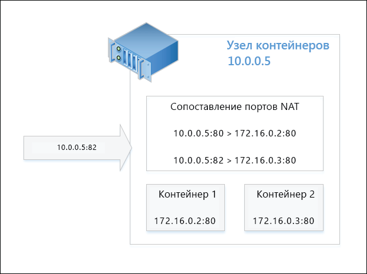
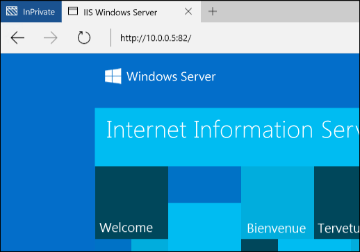

# Сетевые подключения контейнеров

**Это предварительное содержимое. Возможны изменения.** 

В отношении сетевых подключений контейнеры Windows функционируют аналогично виртуальным машинам. В каждом контейнере имеется виртуальный сетевой адаптер, подключенный к виртуальному коммутатору, по которому перенаправляется входящий и исходящий трафик. Чтобы обеспечить изоляцию между контейнерами на одном узле, для каждого контейнера Windows Server и Hyper-V создается секция сети, куда устанавливается сетевой адаптер этого контейнера. Для подключения к виртуальному коммутатору контейнеры Windows Server используют виртуальный сетевой адаптер узла. Для подключения к виртуальному коммутатору контейнеры Hyper-V используют сетевой адаптер синтетической виртуальной машины (не предоставляется служебной виртуальной машине).

Контейнеры Windows поддерживают четыре различных сетевых режима.

- **Режим преобразования сетевых адресов.** Каждый контейнер подключен к внутреннему виртуальному коммутатору и использует WinNAT для подключения к частной IP-подсети. WinNAT выполняет как преобразование сетевых адресов (NAT), так и преобразование адресов портов (PAT) между узлом контейнера и самим контейнерами.

- **Прозрачный режим.** Каждый контейнер подключен к внешнему виртуальному коммутатору и соединяется напрямую с физической сетью. IP-адреса могут назначаться статически или динамически с помощью внешнего DHCP-сервера. Кадры необработанного сетевого трафика для контейнеров передаются прямо по физической сети без преобразования адресов.

- **Режим моста L2**. Каждый контейнер подключен к внешнему виртуальному коммутатору. Сетевой трафик между двумя контейнерами, находящимися в одной IP-подсети и подключенными к одному узлу контейнера, передается напрямую через мост. Сетевой трафик между двумя контейнерами, находящимися в разных IP-подсетях или подключенными к разным узлам контейнера, передается через внешний виртуальный коммутатор. Исходный MAC-адрес исходящего сетевого трафика из контейнера перезаписывается на адрес узла контейнера. Конечный MAC-адрес входящего сетевого трафика для контейнера перезаписывается на адрес самого контейнера.

- **Туннельный режим L2** - *(этот режим должен использоваться только в Microsoft Cloud Stack)*. Как и в режиме моста L2, каждый контейнер подключен к внешнему виртуальному коммутатору, а для исходящего и входящего трафика выполняется перезапись MAC-адресов. Однако ВЕСЬ сетевой трафик контейнеров перенаправляется на виртуальный коммутатор физического узла независимо от настройки взаимодействия уровня 2. Это позволяет применять политику сети на виртуальном коммутаторе физического узла, как это запрограммировано на более высоких уровнях сетевого стека (например, в сетевом контроллере или поставщике сетевых ресурсов).

В этом документе подробно рассматриваются преимущества и конфигурация каждого из этих режимов.

## Создание сети

### Обзор

Для создания сетей контейнеров, подключения контейнеров к сети и настройки правил перенаправления портов можно использовать как PowerShell, так и Docker. Со временем акцент сместится на сетевые команды Docker в соответствии с моделью облачной сети (CNM) Docker.

Допустимыми драйверами для создания сети Docker являются "transparent", "nat" и "l2bridge". Как было указано ранее, драйвер туннеля L2 следует использовать только в сценариях развертывания общедоступного облака Microsoft Azure. 

> Имена всех сетевых драйверов Docker состоят из строчных букв.

Управляющая программа Docker ссылается на различные сетевые режимы по имени драйвера, используемого для создания сети. Например, сетевой режим NAT имеет соответствующий сетевой драйвер Docker с именем nat. По умолчанию подсистема Docker в Windows ищет сеть с драйвером nat. Если сеть NAT не существует, подсистема Docker создает ее. По умолчанию все создаваемые контейнеры подключаются к сети nat.

Такое поведение (с использованием сетевого драйвера NAT по умолчанию) можно переопределить. Для этого следует указать определенный "мост" с именем "none", воспользовавшись параметром -b none при запуске подсистемы управляющей программы Docker.

Чтобы остановить службу, воспользуйтесь следующей командой PowerShell.

```none
Stop-Service docker
```

Файл конфигурации находится в каталоге `c:\programdata\docker\runDockerDaemon.cmd`. Измените следующую строку и добавьте `-b "none"`

```none
dockerd -b "none"
```

Перезапустите службу.

```none
Start-Service docker
```

В случае запуска управляющей программы Docker с параметром -b "none" требуется создать определенную сеть и ссылаться на нее во время создания или запуска контейнера.

Чтобы вывести список сетей контейнеров, доступных на узле, используйте приведенные ниже команды Docker или PowerShell.

```none
docker network ls
```
Выходные данные аналогичны следующим:

```none
NETWORK ID          NAME                DRIVER
bd8b691a8286        nat                 nat
7b055c7ed373        none                null
```
Или аналог для PowerShell:


```none
Get-ContainerNetwork |fl
```

Выходные данные аналогичны следующим:

```none
Name               : nat
SubnetPrefix       : {172.16.0.0/12}
Gateways           : {172.16.0.1}
Id                 : 67ea1851-326d-408b-a5ef-7dcdb15c4438
Mode               : NAT
NetworkAdapterName :
SourceMac          :
DNSServers         : {10.222.118.22, 10.221.228.12, 10.222.114.67}
DNSSuffix          : corp.microsoft.com
IsDeleted          : False
```

> В PowerShell имена сетевых режимов указываются без учета регистра.


### Сетевое взаимодействие NAT

**Преобразование сетевых адресов** — этот сетевой режим удобен для быстрого назначения частных IP-адресов контейнерам. Внешний доступ к контейнеру предоставляется через сопоставление порта между внешним IP-адресом и портом (узел контейнера) и внутренним IP-адресом и портом контейнера. Весь сетевой трафик, полученный для сочетания внешнего IP-адреса и порта, сравнивается с таблицей сопоставления портов WinNAT и перенаправляется на IP-адрес и порт подходящего контейнера. Кроме того, NAT позволяет нескольким контейнерам размещать приложения, которым требуются одинаковые (внутренние) порты связи, сопоставляя их с уникальными внешними портами. В TP5 может существовать только одна сеть NAT.

> В TP5 для всех сопоставлений статических портов NAT автоматически создается правило брандмауэра. Оно является глобальным по отношению к узлу контейнера и не ограничивается конкретным контейнером конечной точки или сетевым адаптером.

#### Конфигурация узла <!--1-->

Для использования сетевого режима NAT создайте сеть контейнера с именем драйвера "nat".

```none
docker network create -d nat MyNatNetwork
```

В команду Docker network create можно добавить дополнительные параметры, такие как IP-адрес шлюза (--gateway=<string[]>) и префикс подсети (--subnet=<string[]>). Дополнительные сведения см. ниже.

Для создания сети NAT с помощью PowerShell используйте приведенный ниже синтаксис. Обратите внимание, что с помощью PowerShell можно указать дополнительные параметры, включая DNSServers и DNSSuffix. Если эти параметры не указаны, они наследуются от узла контейнера.

```none
New-ContainerNetwork -Name MyNatNetwork -Mode NAT -SubnetPrefix "172.16.0.0/12" [-GatewayAddress <address>] [-DNSServers <address>] [-DNSSuffix <string>]
```

### Прозрачное сетевое взаимодействие

**Прозрачное сетевое взаимодействие** — этот сетевой режим следует использовать только в очень небольших развертываниях, где требуется прямое взаимодействие между контейнерами и физической сетью. В такой конфигурации все сетевые службы, запущенные в контейнере, будут доступны напрямую из физической сети. IP-адреса можно назначать статически, предполагая, что они находятся в пределах префикса IP-подсети физической сети и не конфликтуют с другими IP-адресами физической сети. IP-адреса также можно назначать динамически с внешнего DHCP-сервера в физической сети. Если DHCP не используется для назначение IP-адресов, можно задать IP-адрес шлюза. 

#### Конфигурация узла <!--2-->

Для использования режима прозрачного сетевого взаимодействия создайте сеть контейнера с именем драйвера "transparent". 

```none
docker network create -d transparent MyTransparentNetwork
```

В этом примере создается прозрачная сеть, которой назначается шлюз.

```none
docker network create -d transparent --gateway=10.50.34.1 "MyTransparentNet"
```

Команда PowerShell будет иметь следующий вид:

```none
New-ContainerNetwork -Name MyTransparentNet -Mode Transparent -NetworkAdapterName "Ethernet"
```

Если узел контейнера виртуализирован и вы хотите использовать DHCP для назначения IP-адресов, необходимо включить MACAddressSpoofing на сетевом адаптере виртуальных машин.

```none
Get-VMNetworkAdapter -VMName ContainerHostVM | Set-VMNetworkAdapter -MacAddressSpoofing On
```

### Сетевое взаимодействие через мост L2

**Сетевое взаимодействие через мост L2** — в этой конфигурации расширение vSwitch, виртуальная платформа фильтрации (VFP) —в узле контейнера будет выступать в качестве моста и по мере необходимости выполнять преобразование адресов уровня 2 (перезапись MAC-адресов). IP-адреса уровня 3 и порты уровня 4 останутся без изменений. IP-адреса можно статически назначить, чтобы они соответствовали префиксу IP-подсети физической сети или, если используется развертывание частного облака Майкрософт, IP-адресу из префикса подсети виртуальной сети.

#### Конфигурация узла <!--3-->

Для использования сетевого режима моста L2 создайте сеть контейнера с именем драйвера "l2bridge". При этом также требуется указать подсеть и шлюз.

```none
docker network create -d l2bridge --subnet=192.168.1.0/24 --gateway=192.168.1.1 MyBridgeNetwork
```

Команда PowerShell будет иметь следующий вид:

```none
New-ContainerNetwork -Name MyBridgeNetwork -Mode L2Bridge -NetworkAdapterName "Ethernet"
```

## Удаление сети

Используйте команду `docker network rm`, чтобы удалить сеть контейнера.

```none
docker network rm "<network name>"
```
Или команду `Remove-ContainerNetwork` в PowerShell:

Через PowerShell
```
Remove-ContainerNetwork -Name <network name>
```

Это приведет к очистке виртуальных коммутаторов Hyper-V, используемых сетью контейнера, а также всех объектов преобразования сетевых адресов, созданных для сетей контейнера nat.

## Сетевые параметры

При создании сети контейнеров или самого контейнера можно указать различные сетевые параметры Docker. Кроме параметра -d (--driver=<network mode>) для указания сетевого режима, при создании сети контейнера также поддерживаются параметры --gateway, --subnet и -o.

### Дополнительные параметры

IP-адрес шлюза можно задать с помощью параметра `--gateway`. Это следует делать только при использовании статически назначаемого выделения IP-адресов (сети transparent).

```none
docker network create -d transparent --gateway=10.50.34.1 "MyTransparentNet"
```

Можно задать префикс IP-подсети с помощью параметра `--subnet`, определяющий сегмент сети, из которого выделяются IP-адреса.

```none
docker network create -d nat --subnet=192.168.0.0/24 "MyCustomNatNetwork"
```
Дополнительные настройки сети контейнера можно сделать через Docker с помощью параметра -o (--opt=map[]). 

Чтобы указать, какой сетевой адаптер в узле контейнера нужно использовать для прозрачной сети, сети L2Bridge или сети туннеля L2, задайте параметр *com.docker.network.windowsshim.interface*. 
```none
docker network create -d transparent -o com.docker.network.windowsshim.interface="Ethernet 2" "TransparentNetTwo"
```

> Сети контейнера, создаваемые с помощью PowerShell, будут недоступны в Docker до перезапуска управляющей программы Docker. При любых других изменениях, внесенных в сеть контейнера с помощью PowerShell, также требуется перезапуск управляющей программы Docker.

### Несколько сетей контейнера

На одном узле контейнера можно создать несколько сетей контейнера со следующими оговорками:
* Для каждого узла контейнера можно создать только одну сеть NAT.
* Каждая из нескольких сетей, использующих внешний коммутатор vSwitch для взаимодействия (например, прозрачный режим, мост L2, прозрачный режим L2), должна использовать свой собственный сетевой адаптер.
* Различные сети должны использовать разные коммутаторы vSwitch.

### Выбор сетей

При создании контейнера Windows можно указать сеть, к которой будет подключен сетевой адаптер контейнера. Если сеть не указана, используется сеть NAT по умолчанию.

Чтобы подключить контейнер к сети NAT, отличной от применяемой по умолчанию (или при использовании параметра -b "none"), используйте параметр --net вместе с командой Docker run.

```none
docker run -it --net=MyTransparentNet windowsservercore cmd
```

### Статический IP-адрес

Статические IP-адреса задаются на сетевом адаптере контейнеров и поддерживаются только для сетевых режимов NAT, прозрачного взаимодействия и L2Bridge. Кроме того, для сети "nat" по умолчанию не поддерживается назначение статических IP-адресов через Docker.

```none
docker run -it --net=MyTransparentNet --ip=10.80.123.32 windowsservercore cmd
```

Назначение статических IP-адресов выполняется непосредственно на сетевом адаптере контейнера и должно осуществляться, только когда контейнер находится в ОСТАНОВЛЕННОМ состоянии. "Горячее добавление" сетевых адаптеров контейнера или изменений в сетевой стек не поддерживается во время выполнения контейнера.

```none
Get-ContainerNetworkAdapter -ContainerName "DemoNAT"

ContainerName Name            Network Id                           Static MacAddress Static IPAddress Maximum Bandwidth
------------- ----            ----------                           ----------------- ---------------- -----------------
DemoNAT       Network Adapter C475D31C-FB42-408E-8493-6DB6C9586915                              0

Set-ContainerNetworkAdapter -ContainerName "DemoNAT" -StaticIPAddress 172.16.0.100
```

Если вы хотите, чтобы IP-адрес выбирался автоматически из диапазона, указанного в префиксе подсети сети контейнера, запустите контейнер, не указывая никакие параметры для сетевого адаптера контейнера.

> Назначение статических IP-адресов через PowerShell не работает на конечных точках контейнера, подключенных к прозрачной сети.

Чтобы узнать, какие контейнеры подключены к определенной сети и какие IP-адреса связаны с этими конечными точками контейнера, можно выполнить приведенную ниже команду.

```none
docker network inspect nat
```

### Создание MAC-адреса

MAC-адрес можно указать с помощью параметра `--mac-address`.

```none
docker run -it --mac="92:d0:c6:0a:29:33" --name="MyContainer" windowsservercore cmd
```

### Сопоставление портов

Чтобы получить доступ к приложениям внутри контейнера, подключенного к сети NAT, между узлом контейнера и сетевым адаптером контейнера должны быть созданы сопоставления портов. Эти сопоставления следует создавать, пока контейнер находится в ОСТАНОВЛЕННОМ состоянии.

В этом примере создается статическое сопоставление порта **80** узла контейнера с портом **80** контейнера.

```none
docker run -it --name=DemoNat -p 80:80 windowsservercore cmd
```

В этом примере создается статическое сопоставление порта **8082** узла контейнера с портом **80** контейнера.

```none
docker run -it --name=DemoNat -p 8082:80 windowsservercore cmd
```

Динамические сопоставления портов также поддерживаются через Docker, чтобы пользователю не требовалось указывать конкретный порт для сопоставления с узла контейнера. На узле контейнера выбирается случайный временный порт, который можно проверить при выполнении команды Docker ps.

```none
docker run -itd --name=DemoNat -p 80 windowsservercore cmd

docker ps
CONTAINER ID        IMAGE               COMMAND             CREATED             STATUS              PORTS                   NAMES
bbf72109b1fc        windowsservercore   "cmd"               6 seconds ago       Up 2 seconds        *0.0.0.0:14824->80/tcp*   DemoNat
```

В этом примере TCP-порт 80 контейнера DemoNat предоставляется извне с узла контейнера через порт 14824.

После создания сопоставления портов доступ к приложению контейнеров может осуществляться через IP-адрес узла контейнера (физического или виртуального) и предоставленный внешний порт. Например, на следующей схеме показана конфигурация NAT с запросом, направленным на внешний порт **82** узла контейнера. На основании сопоставления портов этот запрос возвратит приложение, размещаемое в контейнере 2.



Просмотр запроса из веб-браузера.




## Особенности и рекомендации

### Брандмауэр

Для узла контейнера требуется создать определенные правила брандмауэра, чтобы разрешить ICMP (проверка связи) и DHCP. Протоколы ICMP и DHCP нужны контейнерам Windows Server для проверки связи между двумя контейнерами на одном узле, а также для получения динамически назначаемых IP-адресов через DHCP. В TP5 эти правила создаются с помощью сценария Install-ContainerHost.ps1. В более поздних версиях они будут создаваться автоматически. Все правила брандмауэра, соответствующие правилам перенаправления портов NAT, будут создаваться автоматически и очищаться после остановки контейнера.

### Неподдерживаемые функции

Сейчас через Docker CLI нельзя выполнить приведенные ниже сетевые функции:
 * Связывание контейнера (например, --link)
 * Разрешение IP-адресов для контейнеров на основании имен

Сейчас в Windows Docker не поддерживаются следующие параметры сети:
 * --add-host
 * --dns
 * --dns-opt
 * --dns-search
 * -h, --hostname
 * --net-alias
 * --aux-address
 * --internal
 * --ip-range

<!--HONumber=May16_HO3-->


