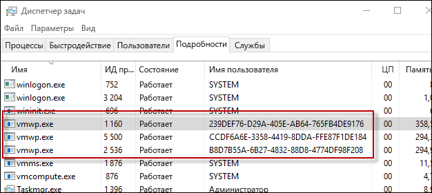

# Контейнеры Hyper-V

**Это предварительное содержимое. Возможны изменения.**

Технология контейнеров Windows включает два различных типа контейнеров: Windows Server и Hyper-V. Оба типа создаются, управляются и работают одинаково. Они даже создают и используют одинаковые образы контейнеров. Отличие заключается в уровне изоляции контейнера, операционной системы узла и других запущенных на этом узле контейнеров.

**Контейнеры Windows Server.** Несколько контейнеров работают на одном узле, а изоляция обеспечивается с помощью пространств имен, управления ресурсами и изоляции процессов. Контейнеры Windows Server совместно используют одно ядро на узле, а также ресурсы друг друга.

**Контейнеры Hyper-V.** Несколько экземпляров контейнера могут работать параллельно на одном узле. Однако каждый контейнер работает внутри отдельной виртуальной машины. Это обеспечивает изоляцию на уровне ядра между контейнером Hyper-V и узлом контейнера.

## PowerShell для контейнеров Hyper-V

### Создание контейнера

Контейнер Hyper-V создается так же, как и контейнер Widows Server. Единственное отличие — это параметр среды выполнения, указывающий, что это контейнер Hyper-V.

Пример создания контейнера Hyper-V с помощью PowerShell

```powershell
PS C:\> $con = New-Container -Name HYPVCON -ContainerImageName NanoServer -SwitchName "Virtual Switch" -RuntimeType HyperV
```

### Преобразование контейнера

Контейнеры Windows Server, созданные с помощью PowerShell, можно преобразовывать в контейнеры Hyper-V.

> В настоящее время Nano Server — единственная операционная система узла, которая поддерживает преобразование среды выполнения.

Создайте контейнер со средой выполнения по умолчанию.

```powershell
PS C:\> New-Container -Name DEMO -ContainerImageName nanoserver -SwitchName NAT
```
Выполните команду, возвращающую свойство среды выполнения из контейнера, и обратите внимание, что установлена среда выполнения по умолчанию.

```powershell
PS C:\> Get-Container | Select ContainerName, RuntimeType

ContainerName RuntimeType
------------- -----------
DEMO              Default
```

Используйте команду `set-container`, чтобы изменить среду выполнения контейнера.

```powershell
PS C:\> Set-Container $con -RuntimeType HyperV
```

Затем повторно выполните команду, возвращающую свойство среды выполнения, чтобы увидеть изменение.

```powershell
PS C:\> Get-Container | select ContainerName, RuntimeType

ContainerName RuntimeType
------------- -----------
DEMO               HyperV
```

## Docker для контейнеров Hyper-V

### Создание контейнера

Управление контейнерами Hyper-V и Windows Server с помощью Docker почти ничем не отличается. При создании контейнера Hyper-V с помощью Docker используется параметр `–isolation=hyperv`.

```powershell
docker run -it --isolation=hyperv 646d6317b02f cmd
```

## Внутренние компоненты

### Рабочий процесс виртуальной машины

Для каждого контейнера Hyper-V создается соответствующий рабочий процесс виртуальной машины.

```powershell
PS C:\> Get-Container | Select Name, RuntimeType, ContainerID | Where {$_.RuntimeType -eq 'Hyperv'}

Name RuntimeType ContainerId
---- ----------- -----------
TST3      HyperV 239def76-d29a-405e-ab64-765fb4de9176
TST       HyperV b8d7b55a-6b27-4832-88d8-4774df98f208
TST2      HyperV ccdf6a6e-3358-4419-8dda-ffe87f1de184
```

Обратите внимание, что соответствующий процесс можно определить по идентификатору контейнера и имени пользователя процесса.



Эту взаимосвязь также можно увидеть с помощью команды `Get-ComputeProcess`.

```powershell
PS C:\> Get-ComputeProcess

Id                                   Name Owner      Type
--                                   ---- -----      ----
239DEF76-D29A-405E-AB64-765FB4DE9176 TST3 VMMS  Container
B8D7B55A-6B27-4832-88D8-4774DF98F208 TST  VMMS  Container
CCDF6A6E-3358-4419-8DDA-FFE87F1DE184 TST2 VMMS  Container
```

Дополнительные сведения о команде `Get-ComputeProcess` см. в разделе [Совместимость средств управления](./hcs_powershell.md).

## Демонстрация изоляции

### Контейнер Windows Server

Следующее упражнение позволяет продемонстрировать изоляцию контейнера Hyper-V. В этом упражнении будет создан как контейнер Windows Server, так и контейнер Hyper-V. Мы рассмотрим процесс, запущенный на узле контейнера, и покажем, что процесс контейнера Windows Server совместно используется на узле контейнера, а процесс контейнера Hyper-V — нет.

```powershell
PS C:\> get-process | where {$_.ProcessName -eq 'csrss'}

Handles  NPM(K)    PM(K)      WS(K) VM(M)   CPU(s)     Id  SI ProcessName
-------  ------    -----      ----- -----   ------     --  -- -----------
    255      12     1820       4000 ...98     0.53    532   0 csrss
    116      11     1284       3700 ...94     0.25    608   1 csrss
    246      13     1844       5504 ...17     3.45   3484   2 csrss
```

Создайте контейнер Windows Server:

```powershell
PS C:\> New-Container -Name WINCONT -ContainerImageName WindowsServerCore -SwitchName "Virtual Switch"
```

Запустите контейнер:

```powershell
PS C:\> Start-Container $con
```

Создайте удаленный сеанс PowerShell с контейнером.

```powershell
PS C:\> Enter-PSSession -ContainerId $con.ContainerId –RunAsAdministrator
```

В удаленном сеансе контейнера выполните команду, возвращающую все процессы с именем csrss. Обратите внимание на идентификатор запущенного процесса csrss (1228 в примере ниже).

```powershell
[WINCONT]: PS C:\> get-process | where {$_.ProcessName -eq 'csrss'}

Handles  NPM(K)    PM(K)      WS(K) VM(M)   CPU(s)     Id  SI ProcessName
-------  ------    -----      ----- -----   ------     --  -- -----------
    167       9     1276       3720 ...97     0.20   1228   3 csrss
```

Теперь выполните команду, возвращающую список процесса csrss с узла контейнера. Обратите внимание, что тот же процесс csrss возвращается с узла контейнера.

```powershell
PS C:\> get-process | where {$_.ProcessName -eq 'csrss'}

Handles  NPM(K)    PM(K)      WS(K) VM(M)   CPU(s)     Id  SI ProcessName
-------  ------    -----      ----- -----   ------     --  -- -----------
    252      11     1712       3968 ...98     0.53    532   0 csrss
    113      11     1176       3676 ...93     0.25    608   1 csrss
    175       9     1260       3708 ...97     0.20   1228   3 csrss
    243      13     1736       5512 ...17     3.77   3484   2 csrss
```
### Контейнер Hyper-V

Выполните команду, возвращающую список процесса csrss с узла контейнера.

```powershell
PS C:\> get-process | where {$_.ProcessName -eq 'csrss'}

Handles  NPM(K)    PM(K)      WS(K) VM(M)   CPU(s)     Id  SI ProcessName
-------  ------    -----      ----- -----   ------     --  -- -----------
    261      12     1820       4004 ...98     0.53    532   0 csrss
    116      11     1284       3704 ...94     0.25    608   1 csrss
    246      13     1844       5536 ...17     3.83   3484   2 csrss
```

Затем создайте контейнер Hyper-V.

```powershell
PS C:\> $con = New-Container -Name HYPVCON -ContainerImageName NanoServer -SwitchName "Virtual Switch" -RuntimeType HyperV
```

Запустите контейнер Hyper-V.

```powershell
PS C:\> Start-Container $con
```

Создайте удаленный сеанс PowerShell с контейнером Hyper-V.

```powershell
PS C:\> Enter-PSSession -ContainerId $con.ContainerId –RunAsAdministrator
```

Выполните команду, возвращающую процесс csrss, запущенный в контейнере Hyper-V. Обратите внимание на идентификатор процесса csrss (956 в примере ниже).

```powershell
[HYPVCON]: PS C:\> get-process | where {$_.ProcessName -eq 'csrss'}

Handles  NPM(K)    PM(K)      WS(K) VM(M)   CPU(s)     Id  SI ProcessName
-------  ------    -----      ----- -----   ------     --  -- -----------
              4      452       1520 ...63     0.06    956   1 csrss
```

Затем выполните команду, возвращающую список процесса csrss на узле контейнера. Обратите внимание, что в отличие от контейнера Windows Server, где процесс csrss видим как в контейнере, так и с узла контейнера, процесс контейнера Hyper-V видим только в самом контейнере. Контейнер Hyper-V инкапсулирован в служебной виртуальной машине, и процесс изолирован в ней.

```powershell
PS C:\> get-process | where {$_.ProcessName -eq 'csrss'}

Handles  NPM(K)    PM(K)      WS(K) VM(M)   CPU(s)     Id  SI ProcessName
-------  ------    -----      ----- -----   ------     --  -- -----------
    255      12     1716       3972 ...98     0.56    532   0 csrss
    113      11     1176       3676 ...93     0.25    608   1 csrss
    243      13     1732       5512 ...18     4.23   3484   2 csrss
```

## Видеоруководство

<iframe src="https://channel9.msdn.com/Blogs/containers/Container-Fundamentals--Part-5-Hyper-V-Containers/player" width="800" height="450"  allowFullScreen="true" frameBorder="0" scrolling="no"></iframe>


<!--HONumber=Feb16_HO2-->
