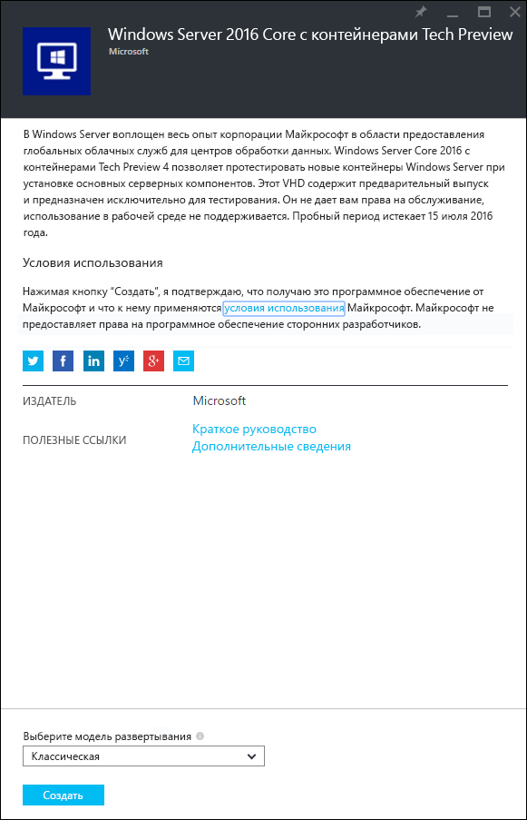
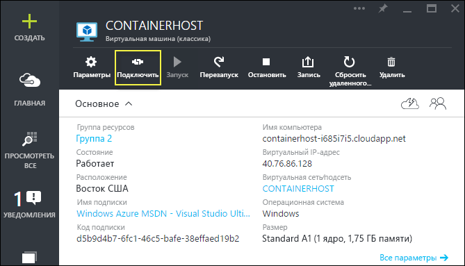
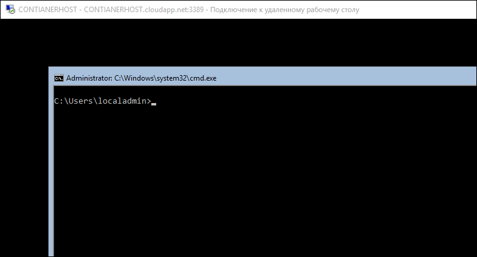

# Быстрый запуск Azure

Чтобы создать контейнеры Windows Server в Azure и управлять ими, необходимо развернуть образ Windows Server 2016 Technical Preview, который был предварительно настроен с помощью компонента контейнеров Windows Server. Данное руководство поможет в этом.

> Microsoft Azure не поддерживает контейнеры Hyper-V. Чтобы выполнить упражнения с контейнером Hyper-V из этой статьи, требуется локальный узел контейнера.

## Начало работы с порталом Azure

Если у вас уже есть учетная запись Azure, перейдите к разделу [Создание виртуальной машины для узла контейнера](#CreateacontainerhostVM).

1. Перейдите на веб-сайт [azure.com](https://azure.com) и следуйте инструкциям для получения [бесплатной пробной версии Azure](https://azure.microsoft.com/en-us/pricing/free-trial/).
2. Выполните вход с учетной записью Майкрософт.
3. Когда ваша учетная запись будет готова к работе, войдите на [портал управления Azure](https://portal.azure.com).

## Создание виртуальной машины для узла контейнера

Когда вы откроете Azure Marketplace и введете слово "контейнеры" в строке поиска, в результатах отобразится пункт "Windows Server 2016 Core with Containers Tech Preview 4".

Выберите этот образ и нажмите кнопку `Создать`.

Дайте имя виртуальной машине, укажите имя пользователя и пароль.

Выберите элементы "Необязательная конфигурация" > "Конечные точки" и введите конечную точку HTTP с частным или общедоступным портом 80, как показано ниже. После завершения дважды нажмите кнопку "ОК".

Нажмите кнопку `Создать`, чтобы запустить развертывание данной виртуальной машины.

После того как развертывание виртуальной машины будет завершено, нажмите кнопку подключения, чтобы запустить сеанс RDP с узлом контейнера Windows Server.

Войдите на виртуальную машину, используя имя пользователя и пароль, указанные во время работы мастера создания виртуальных машин. После входа вы увидите командную строку Windows.

## Видеоруководство

<iframe src="https://channel9.msdn.com/Blogs/containers/Quick-Start-Configure-Windows-Server-Containers-in-Microsoft-Azure/player#ccLang=ru" width="800" height="450"  allowFullScreen="true" frameBorder="0" scrolling="no"></iframe>

## Дальнейшие действия: начало работы с контейнерами

Установив систему Windows Server 2016 с компонентом контейнеров Windows Server, ознакомьтесь со следующими руководствами по началу работы с контейнерами Windows Server и их образами.

[Быстрый запуск: контейнеры Windows и Docker](./manage_docker.md)  
[Быстрый запуск: контейнеры Windows и PowerShell](./manage_powershell.md)

<!--HONumber=Feb16_HO3-->
