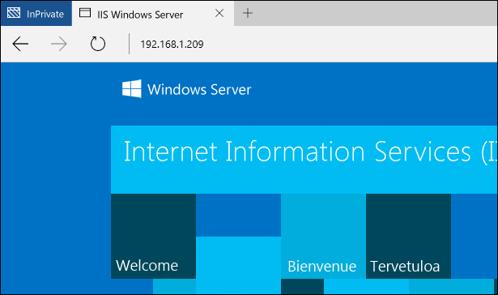
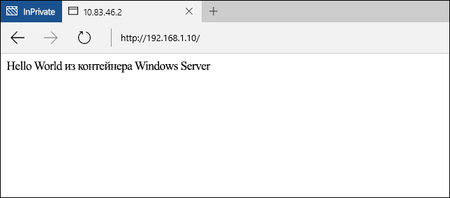
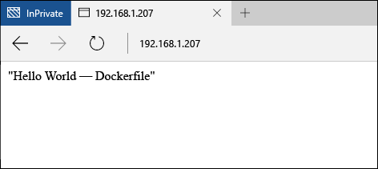

# Краткое руководство: контейнеры Windows и Docker

Контейнеры Windows позволяют быстро развертывать много изолированных приложений на одном компьютере. В этом упражнении показано создание контейнера Windows и управление им с помощью Docker. В результате вы получите базовое понимание того, как использовать Docker с контейнерами Windows, а также опыт работы с этой технологией.

В этом пошаговом руководстве подробно описываются контейнеры Windows Server и Hyper-V. У каждого типа контейнера свои базовые требования. В документацию по контейнерам Windows входит описание быстрого развертывания узла контейнера. Это самый простой способ сразу начать работать с контейнерами Windows. Если у вас еще нет узла контейнера, см. [краткое руководство по развертыванию узла контейнера](./container_setup.md).

Следующие элементы обязательны для каждого упражнения.

**Контейнеры Windows Server:**

- Узел контейнера Windows под управлением Windows Server 2016 (полная версия или Core) в локальной среде или в Azure.

**Контейнеры Hyper-V:**

- Узел контейнера Windows, включенный с помощью вложенной виртуализации.
- Windows Server 2016 Media — [Загрузить](https://aka.ms/tp4/serveriso).

> Microsoft Azure не поддерживает контейнеры Hyper-V. Чтобы выполнить упражнения с контейнером Hyper-V, требуется локальный узел контейнера.

## Контейнер Windows Server

Контейнеры Windows Server обеспечивают изолированную, портативную операционную среду с регулируемыми ресурсами для запуска приложений и размещения процессов. Контейнеры Windows Server обеспечивают изоляцию контейнера и узла путем изоляции процессов и пространств имен.

### Создание контейнера

Прежде чем создавать контейнер, воспользуйтесь командой `docker images`, чтобы вывести список образов, установленных на узле.

```powershell
PS C:\> docker images

REPOSITORY          TAG                 IMAGE ID            CREATED             VIRTUAL SIZE
windowsservercore   10.0.10586.0        6801d964fda5        2 weeks ago         0 B
windowsservercore   latest              6801d964fda5        2 weeks ago         0 B
nanoserver          10.0.10586.0        8572198a60f1        2 weeks ago         0 B
nanoserver          latest              8572198a60f1        2 weeks ago         0 B
```

В этом примере создайте контейнер с помощью образа Windows Server Core. Для этого выполните `команду docker run`. Дополнительные сведения о команде `docker run` см. в [справке по Docker Run на сайте docker.com](https://docs.docker.com/engine/reference/run/).

В этом примере создается контейнер с именем `iisbase` и запускается интерактивный сеанс с этим контейнером.

```powershell
C:\> docker run --name iisbase -it windowsservercore cmd
```

После создания контейнера вы будете работать в сеансе оболочки из контейнера.


### Создание образа IIS

Из контейнера будут установлены службы IIS и создан образ. Чтобы установить службы IIS, выполните следующую команду.

```powershell
C:\> powershell.exe Install-WindowsFeature web-server
```

По окончании завершите интерактивной сеанс оболочки.

```powershell
C:\> exit
```

Далее этот контейнер будет сохранен в новом образе контейнера с помощью команды `docker commit`. В этом примере создается новый образ контейнера с именем `windowsservercoreiis`.

```powershell
C:\> docker commit iisbase windowsservercoreiis
4193c9f34e320c4e2c52ec52550df225b2243927ed21f014fbfff3f29474b090
```

Новые образы IIS можно просмотреть с помощью команды `docker images`.

```powershell
C:\> docker images

REPOSITORY             TAG                 IMAGE ID            CREATED             VIRTUAL SIZE
windowsservercoreiis   latest              4193c9f34e32        4 minutes ago       170.8 MB
windowsservercore      10.0.10586.0        6801d964fda5        2 weeks ago         0 B
windowsservercore      latest              6801d964fda5        2 weeks ago         0 B
nanoserver             10.0.10586.0        8572198a60f1        2 weeks ago         0 B
nanoserver             latest              8572198a60f1        2 weeks ago         0 B
```

### Настройка сети

Перед созданием контейнера с помощью Docker необходимо создать правило для брандмауэра Windows, которое позволит контейнеру подключаться к сети. Запустите следующий сценарий PowerShell, чтобы создать правило для порта 80. Примечание. Сценарий необходимо запустить из сеанса PowerShell.

```powershell
if (!(Get-NetFirewallRule | where {$_.Name -eq "TCP80"})) {
    New-NetFirewallRule -Name "TCP80" -DisplayName "HTTP on TCP/80" -Protocol tcp -LocalPort 80 -Action Allow -Enabled True
}
```

Кроме того, обратите внимание на IP-адрес узла контейнера. Он будет использоваться в этом упражнении.

### Создание контейнера IIS

Теперь у вас есть образ контейнера, содержащий службы IIS, который можно использовать для развертывания операционных сред с поддержкой служб IIS.

Чтобы создать контейнер из нового образа, используйте команду `docker run`, на этот раз указав имя образа IIS. Обратите внимание, что в этом примере указан параметр `-p 80:80`. Так как контейнер подключен к виртуальному коммутатору, который предоставляет IP-адреса через преобразование сетевых адресов (NAT), порт узла контейнера необходимо сопоставить с портом IP-адреса NAT контейнера. Дополнительные сведения о параметре `-p` см. в [справке по Docker Run на сайте docker.com](https://docs.docker.com/engine/reference/run/).

```powershell
C:\> docker run --name iisdemo -it -p 80:80 windowsservercoreiis cmd
```

После создания контейнера откройте браузер и введите IP-адрес узла контейнера. Так как порт 80 узла сопоставлен с портом 80 контейнера, должен отобразиться экран-заставка IIS.



### Создание приложения

Выполните следующую команду, чтобы удалить экран-заставку IIS.

```powershell
C:\> del C:\inetpub\wwwroot\iisstart.htm
```

Выполните приведенную ниже команду, чтобы заменить сайт IIS по умолчанию новым статическим сайтом.

```powershell
C:\> echo "Hello World From a Windows Server Container" > C:\inetpub\wwwroot\index.html
```

Снова перейдите к IP-адресу узла контейнера. Вы увидите приложение "Hello, World!". Обратите внимание, что для просмотра обновленного приложения может потребоваться прервать все подключения через браузер или очистить кэш браузера.



Завершите интерактивный сеанс с контейнером.

```powershell
C:\> exit
```

Удалите контейнер.

```powershell
C:\> docker rm iisdemo
```
Удалите образ IIS.

```powershell
C:\> docker rmi windowsservercoreiis
```

## Dockerfile

В последнем упражнении мы вручную создали и изменили контейнер, а затем сохранили его в новом образе контейнера. Docker содержит метод автоматизации этого процесса с помощью файла dockerfile. В этом упражнении будут такие же результаты, как и в последнем, но здесь процесс полностью автоматизирован.

### Создание образа IIS

На узле контейнера создайте каталог `c:\build`, а в нем — файл с именем `dockerfile`.

```powershell
C:\> powershell new-item c:\build\dockerfile -Force
```

Откройте файл dockerfile в блокноте.

```powershell
C:\> notepad c:\build\dockerfile
```

Скопируйте в него следующий текст и сохраните файл. Эти команды дают Docker указание создать новый образ на основе образа `windowsservercore` и включить изменения, указанные с помощью команды `RUN`. Дополнительные сведения о файлах Dockerfile см. в [справке по Dockerfile на сайте docker.com](http://docs.docker.com/engine/reference/builder/).

```powershell
FROM windowsservercore
RUN dism /online /enable-feature /all /featurename:iis-webserver /NoRestart
RUN echo "Hello World - Dockerfile" > c:\inetpub\wwwroot\index.html
```

Эта команда запускает автоматический процесс создания образа. Параметр `-t` дает процессу указание присвоить новому образу имя `iis`.

```powershell
C:\> docker build -t iis c:\Build
```

После завершения процедуры можно убедиться, что образ создан, используя команду `docker images`.

```powershell
C:\> docker images

REPOSITORY          TAG                 IMAGE ID            CREATED             VIRTUAL SIZE
iis                 latest              abb93867b6f4        26 seconds ago      209 MB
windowsservercore   10.0.10586.0        6801d964fda5        2 weeks ago         0 B
windowsservercore   latest              6801d964fda5        2 weeks ago         0 B
nanoserver          10.0.10586.0        8572198a60f1        2 weeks ago         0 B
nanoserver          latest              8572198a60f1        2 weeks ago         0 B
```

### Развертывание контейнера IIS

А теперь, как было показано в предыдущем упражнении, разверните контейнер, сопоставив порт 80 узла с портом 80 контейнера.

```powershell
C:\> docker run --name iisdemo -it -p 80:80 iis cmd
```

После создания контейнера введите IP-адрес узла контейнера в браузере. Должно открыться приложение "Hello, World!".



Завершите интерактивный сеанс с контейнером.

```powershell
C:\> exit
```

Удалите контейнер.

```powershell
C:\> docker rm iisdemo
```
Удалите образ IIS.

```powershell
C:\> docker rmi iis
```

## Контейнер Hyper-V

Контейнеры Hyper-V обеспечивают дополнительный уровень изоляции по сравнению с контейнерами Windows Server. Каждый контейнер Hyper-V создается в высокооптимизированной виртуальной машине. У контейнера Windows Server и узла контейнера общее ядро, а контейнер Hyper-V полностью изолирован. Контейнеры Hyper-V создаются и управляются так же, как и контейнеры Windows Server. Дополнительные сведения о контейнерах Hyper-V см. в статье [Управление контейнерами Hyper-V](../management/hyperv_container.md).

> Microsoft Azure не поддерживает контейнеры Hyper-V. Чтобы выполнить упражнения с контейнером Hyper-V, требуется локальный узел контейнера.

### Создание контейнера

Так как контейнер будет работать под управлением образа ОС Nano Server, для установки служб IIS требуются пакеты Nano Server IIS. Их можно найти на установочном носителе Windows Server 2016 TP4 в каталоге `NanoServer\Packages`.

В этом примере запущенному контейнеру будет предоставлен доступ к каталогу на узле контейнера с помощью параметра `-v` команды `docker run`. Перед этим необходимо настроить исходный каталог.

На узле контейнера создайте каталог, к которому будет предоставлен доступ. Если вы уже выполнили пошаговые инструкции для PowerShell, возможно, этот каталог и необходимые файлы уже существуют.

```powershell
C:\> powershell New-Item -Type Directory c:\share\en-us
```

Скопируйте файл `Microsoft-NanoServer-IIS-Package.cab` из каталога `NanoServer\Packages` в папку `c:\share` на данном узле контейнера.

Скопируйте файл `NanoServer\Packages\en-us\Microsoft-NanoServer-IIS-Package.cab` в папку `c:\share\en-us` на данном узле контейнера.

Создайте файл unattend.xml в папке "c:\share" и скопируйте в этот файл приведенный ниже текст.

```powershell
<?xml version="1.0" encoding="utf-8"?>
<unattend xmlns="urn:schemas-microsoft-com:unattend">
    <servicing>
        <package action="install">
            <assemblyIdentity name="Microsoft-NanoServer-IIS-Package" version="10.0.10586.0" processorArchitecture="amd64" publicKeyToken="31bf3856ad364e35" language="neutral" />
            <source location="c:\iisinstall\Microsoft-NanoServer-IIS-Package.cab" />
        </package>
        <package action="install">
            <assemblyIdentity name="Microsoft-NanoServer-IIS-Package" version="10.0.10586.0" processorArchitecture="amd64" publicKeyToken="31bf3856ad364e35" language="en-US" />
            <source location="c:\iisinstall\en-us\Microsoft-NanoServer-IIS-Package.cab" />
        </package>
    </servicing>
</unattend>
```

После завершения этой процедуры каталог `c:\share` на узле контейнера должен быть настроен следующим образом.

```
c:\share
|-- en-us
|    |-- Microsoft-NanoServer-IIS-Package.cab
|
|-- Microsoft-NanoServer-IIS-Package.cab
|-- unattend.xml
```

Чтобы создать контейнер Hyper-V с помощью docker, укажите параметр `--isolation=hyperv`. В этом примере каталог `c:\share` узла подключается к каталогу `c:\iisinstall` контейнера, а затем создается интерактивный сеанс оболочки с этим контейнером.

```powershell
C:\> docker run --name iisnanobase -it -v c:\share:c:\iisinstall --isolation=hyperv nanoserver cmd
```

### Создание образа IIS

Службы IIS можно установить из сеанса оболочки контейнера с помощью команды `dism`. Чтобы установить службы IIS в контейнере, выполните следующую команду.

```powershell
C:\> dism /online /apply-unattend:c:\iisinstall\unattend.xml
```

После установки служб IIS запустите их вручную с помощью следующей команды.

```powershell
C:\> Net start w3svc
```

Завершите сеанс контейнера.

```powershell
C:\> exit
```

### Создание контейнера IIS

Теперь измененный контейнер Nano Server можно сохранить в новый образ контейнера. Для этого используйте команду `docker commit`.

```powershell
C:\> docker commit iisnanobase nanoserveriis
```

Результаты можно увидеть в списке образов контейнеров.

```powershell
C:\> docker images

REPOSITORY          TAG                 IMAGE ID            CREATED              VIRTUAL SIZE
nanoserveriis       latest              444435a4e30f        About a minute ago   69.14 MB
windowsservercore   10.0.10586.0        6801d964fda5        2 weeks ago          0 B
windowsservercore   latest              6801d964fda5        2 weeks ago          0 B
nanoserver          10.0.10586.0        8572198a60f1        2 weeks ago          0 B
nanoserver          latest              8572198a60f1        2 weeks ago          0 B
```

### Создание приложения

Теперь образ IIS Nano Server можно развернуть в новом контейнере.

```powershell
C:\> docker run -it -p 80:80 --isolation=hyperv nanoserveriis cmd
```

Выполните следующую команду, чтобы удалить экран-заставку IIS.

```powershell
C:\> del C:\inetpub\wwwroot\iisstart.htm
```

Выполните следующую команду, чтобы заменить сайт IIS по умолчанию на новый статический сайт.

```powershell
C:\> echo "Hello World From a Hyper-V Container" > C:\inetpub\wwwroot\index.html
```

В браузере введите IP-адрес узла контейнера. Должно открыться приложение "Hello, World!". Обратите внимание: чтобы вы могли увидеть обновленное приложение, может потребоваться закрыть все существующие подключения браузера или очистить кэш.


Завершите интерактивный сеанс с контейнером.

```powershell
C:\> exit
```


<!--HONumber=Feb16_HO2-->
