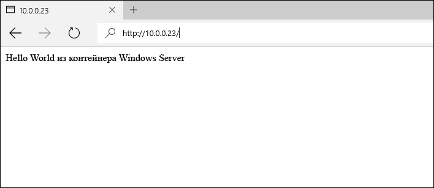

# Образы контейнеров в Windows Server

**Это предварительное содержимое. Возможны изменения.** 

В предыдущем кратком руководстве по Windows Server контейнер Windows создавался из существующего образа контейнера. В этом упражнении подробно описывается создание пользовательских образов контейнера вручную, а также с помощью Dockerfile.

В этом кратком руководстве рассматриваются контейнеры Windows Server в Windows Server 2016. Дополнительную документацию по быстрому началу работы можно найти в содержании в левой части этой страницы. 

**Предварительные требования:**

- Одна компьютерная система (физическая или виртуальная), работающая под управлением [Windows Server 2016 Technical Preview 5](https://www.microsoft.com/en-us/evalcenter/evaluate-windows-server-technical-preview).
- Настройте на компьютере компонент контейнеров Windows и Docker. Пошаговые инструкции по этим этапам см. в статье [Контейнеры Windows в Windows Server](./quick_start_windows_server.md).

## 1. Образ контейнера — ручная процедура

Для получения наилучших результатов выполняйте это упражнение из командной оболочки (cmd.exe) Windows.

Первый этап ручного создания образа контейнера заключается в развертывании контейнера. В рамках этого примера разверните контейнер IIS из готового образа IIS. После развертывания контейнера вы будете работать в сеансе оболочки из контейнера. Интерактивный сеанс инициируется с помощью с флага `-it`. Дополнительные сведения о команде Docker Run см. в [справке по команде Docker Run на сайте Docker.com]( https://docs.docker.com/engine/reference/run/). 

```none
docker run -it -p 80:80 microsoft/iis:windowsservercore cmd
```

Далее в контейнер будут внесены изменения. Выполните приведенную ниже команду для удаления экрана-заставки IIS.

```none
del C:\inetpub\wwwroot\iisstart.htm
```

Выполните приведенную ниже команду, чтобы заменить сайт IIS по умолчанию новым статическим сайтом.

```none
echo "Hello World From a Windows Server Container" > C:\inetpub\wwwroot\index.html
```

Перейдя на другую систему, введите IP-адрес узла контейнера в браузере. Должно открыться приложение "Hello, World".

**Примечание.** Если вы работаете в Azure, потребуется правило группы безопасности сети, разрешающее передачу трафика через порт 80. Дополнительные сведения см. в разделе [Create Rule in a Network Security Group]( https://azure.microsoft.com/en-us/documentation/articles/virtual-networks-create-nsg-arm-pportal/#create-rules-in-an-existing-nsg) (Создание правила в группе безопасности сети).



Вернитесь в контейнер и выйдите из интерактивного сеанса.

```none
exit
```

Теперь измененный контейнер можно записать в новый образ контейнера. Для этого потребуется имя контейнера. Его можно определить с помощью команды `docker ps -a`.

```none
docker ps -a

CONTAINER ID     IMAGE                             COMMAND   CREATED             STATUS   PORTS   NAMES
489b0b447949     microsoft/iis:windowsservercore   "cmd"     About an hour ago   Exited           pedantic_lichterman
```

Чтобы создать образ контейнера, используйте команду `docker commit`. Команда Docker commit принимает вид "docker commit имя_контейнера имя_нового_образа". Примечание. Замените имя контейнера в данном примере на используемое вами.

```none
docker commit pedantic_lichterman modified-iis
```

Чтобы убедиться, что новый образ создан, используйте команду `docker images`.  

```none
docker images

REPOSITORY          TAG                 IMAGE ID            CREATED              SIZE
modified-iis        latest              3e4fdb6ed3bc        About a minute ago   10.17 GB
microsoft/iis       windowsservercore   c26f4ceb81db        2 weeks ago          9.48 GB
windowsservercore   10.0.14300.1000     dbfee88ee9fd        8 weeks ago          9.344 GB
windowsservercore   latest              dbfee88ee9fd        8 weeks ago          9.344 GB
```

Теперь можно развернуть этот образ. Полученный контейнер будет содержать все зафиксированные изменения.

## 2. Образ контейнера — Dockerfile

В последнем упражнении мы вручную создали и изменили контейнер, а затем сохранили его в новом образе контейнера. Docker содержит метод автоматизации этого процесса с помощью файла Dockerfile. В этом упражнении будут почти такие же результаты, как и в последнем, но здесь процесс автоматизирован.

На узле контейнера создайте каталог `c:\build`, а в нем — файл с именем `Dockerfile`. Обратите внимание, что этот файл не должен иметь расширение.

```none
powershell new-item c:\build\Dockerfile -Force
```

Откройте файл Dockerfile в блокноте.

```none
notepad c:\build\Dockerfile
```

Скопируйте в него приведенный ниже текст и сохраните файл. Эти команды дают Docker указание создать новый образ, приняв `microsoft/iis` в качестве основы. После этого файл Dockerfile выполняет команды, заданные в инструкции `RUN`. В этом случае обновляется содержимое файла index.html. 

Дополнительные сведения о файлах Dockerfile см. в статье [Файлы Dockerfile в Windows](../docker/manage_windows_dockerfile.md).

```none
FROM microsoft/iis:windowsservercore
RUN echo "Hello World - Dockerfile" > c:\inetpub\wwwroot\index.html
```

Команда `docker build` запускает процесс создания образа. Параметр `-t` дает процессу указание присвоить новому образу имя `iis-dockerfile`.

```none
docker build -t iis-dockerfile c:\Build
```

После завершения можно убедиться, что образ создан, используя команду `docker images`.

```none
docker images

REPOSITORY          TAG                 IMAGE ID            CREATED             SIZE
iis-dockerfile      latest              8d1ab4e7e48e        2 seconds ago       9.483 GB
microsoft/iis       windowsservercore   c26f4ceb81db        2 weeks ago         9.48 GB
windowsservercore   10.0.14300.1000     dbfee88ee9fd        8 weeks ago         9.344 GB
windowsservercore   latest              dbfee88ee9fd        8 weeks ago         9.344 GB
```

Теперь разверните контейнер с помощью следующей команды: 

```none
docker run -d -p 80:80 iis-dockerfile ping -t localhost
```

После создания контейнера введите IP-адрес узла контейнера в браузере. Должно открыться приложение "Hello, World!".


Вернитесь на узел контейнера и выполните команду `docker ps`, чтобы получить имя контейнера, и команду `docker rm`, чтобы удалить контейнер. Примечание. Замените имя контейнера в данном примере на используемое вами.

Получите имя контейнера.

```none
docker ps

CONTAINER ID   IMAGE            COMMAND               CREATED              STATUS              PORTS                NAMES
c1dc6c1387b9   iis-dockerfile   "ping -t localhost"   About a minute ago   Up About a minute   0.0.0.0:80->80/tcp   cranky_brown
```

Удалите контейнер.

```none
docker rm -f cranky_brown
```

## Дальнейшие шаги

[Контейнеры Windows в Windows 10](./quick_start_windows_10.md)


<!--HONumber=Jun16_HO5-->


